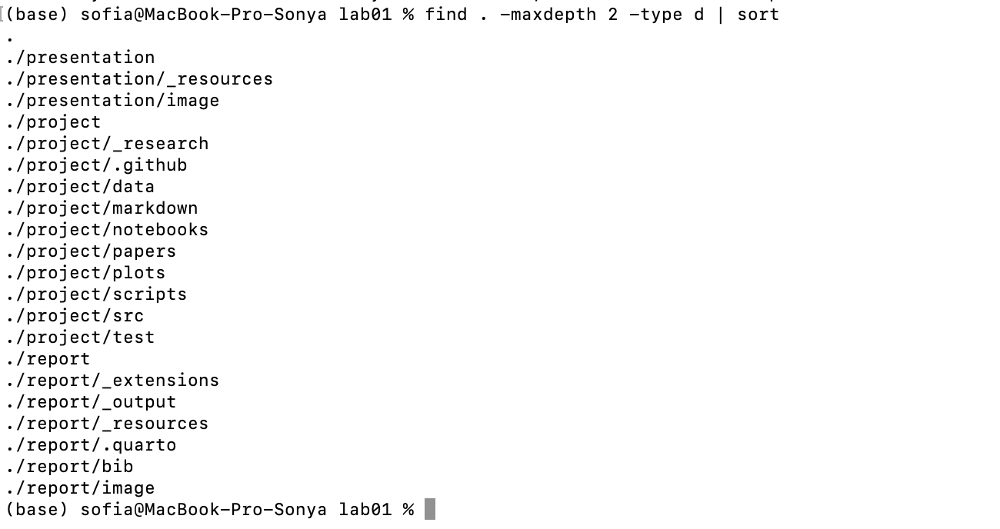
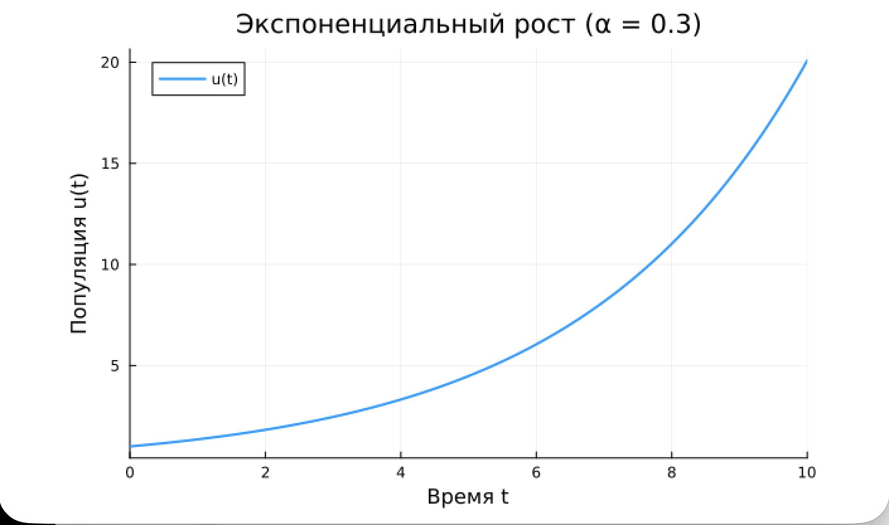
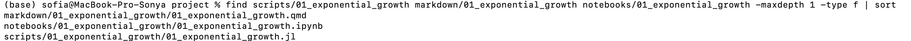
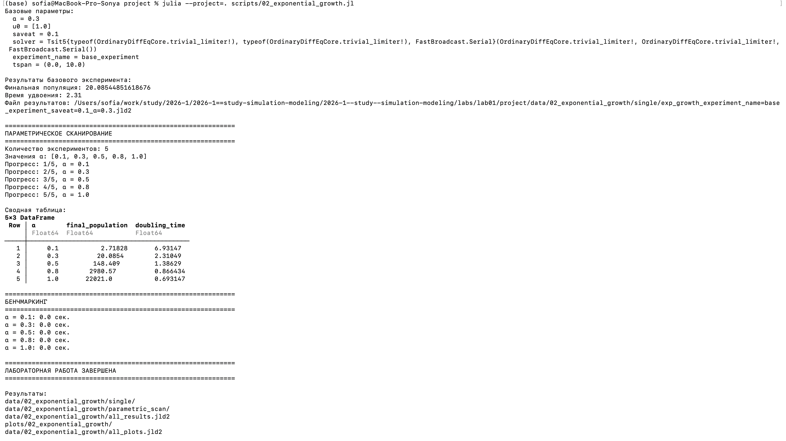
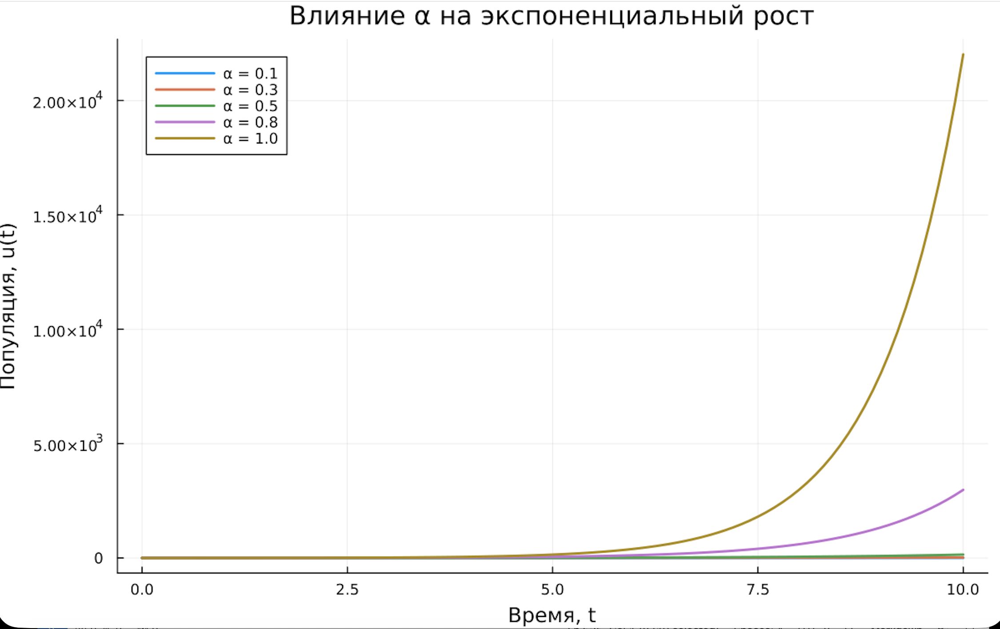
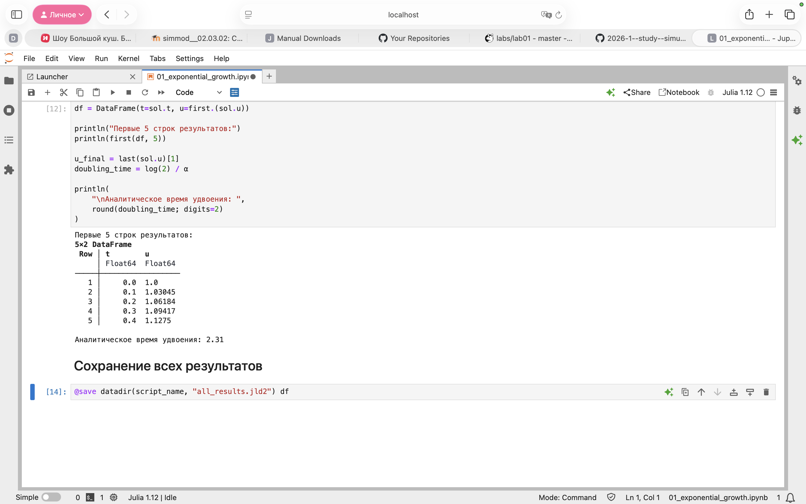
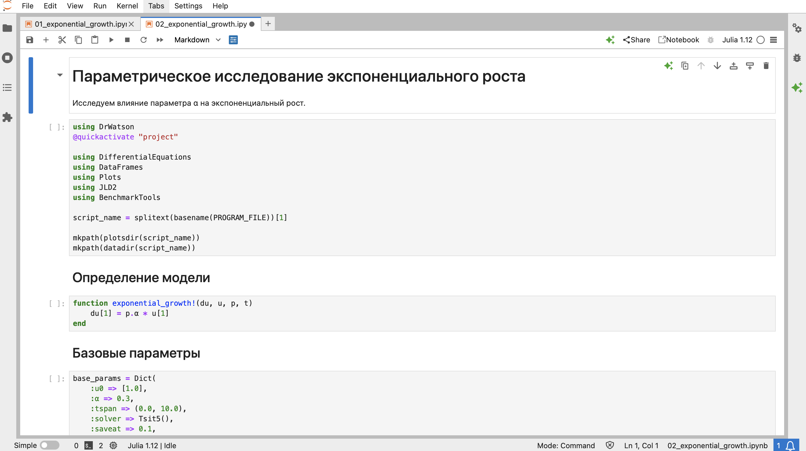
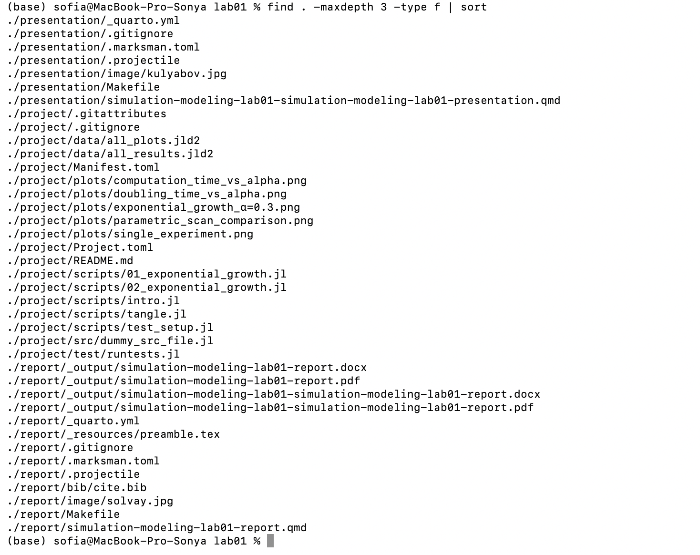

---
## Author
author:
  name: Кудякова София Андреевна
  degrees: студент
  email: 1132236033@rudn.ru
  affiliation:
    - name: Российский университет дружбы народов
      country: Российская Федерация
      postal-code: 117198
      city: Москва
      address: ул. Миклухо-Маклая, д. 6
## Title
title: "Лабораторная работа №1"
subtitle: "Работа с Git и моделирование экспоненциального роста"
license: CC BY
date: today
date-format: "2026-08-25"
format:
  beamer:
    pdf-engine: xelatex
    aspectratio: 169
    section-titles: true
    lang: ru
    babel-lang: russian
    babel-otherlangs: english
    keep-tex: true
---

# Вводная часть

## Актуальность

- Git используется для контроля версий и синхронизации проекта
- DrWatson обеспечивает структуру и воспроизводимость вычислений
- Julia используется для численного моделирования
- Literate и Quarto позволяют автоматизировать подготовку документации

## Цель и задачи

**Цель:** настроить рабочее окружение и исследовать модель экспоненциального роста.

**Задачи:**

- настроить Git и SSH;
- создать проект DrWatson;
- реализовать модель на Julia;
- выполнить моделирование;
- провести параметрическое исследование;
- подготовить Jupyter Notebook и Quarto-отчёт.

## Модель экспоненциального роста

Дифференциальное уравнение:

$$
\frac{du}{dt}=\alpha u
$$

Начальное условие:

$$
u(0)=u_0
$$

Аналитическое решение:

$$
u(t)=u_0e^{\alpha t}
$$

# Выполнение

## Настройка Git

- Настроены имя и электронная почта пользователя
- Настроены параметры отображения путей и окончания строк
- Настроен базовый branch по умолчанию

{#fig-001 width=70%}

## Настройка SSH-доступа

- Создан SSH-ключ по алгоритму Ed25519
- Открытая часть ключа добавлена в удалённый репозиторий
- Проверено соединение — аутентификация настроена корректно

{#fig-002 width=70%}

## Настройка GitVerse

- Настроен GitVerse как дополнительная платформа хранения
- Проверен доступ к репозиторию
- Настроено взаимодействие через Git

{#fig-333 width=70%}

## Рабочее пространство курса

- Создан каталог лабораторной работы lab01
- project — вычисления и результаты
- report — документация

{#fig-003 width=70%}

## Проект DrWatson

Основные каталоги проекта:

- data/ — данные
- plots/ — графики
- scripts/ — скрипты
- notebooks/ — Jupyter Notebook
- markdown/ — документы Quarto
- src/ — исходный код

{#fig-004 width=70%}

## Установка пакетов

Подключены основные пакеты:

- DrWatson, DifferentialEquations, Plots
- DataFrames, JLD2, Literate
- IJulia, BenchmarkTools, Quarto

{#fig-005 width=70%}

## Проверка проекта

- Выполнена активация проекта через `@quickactivate`
- Проверены основные пути проекта (root, data, scripts, plots)
- Окружение настроено корректно

{#fig-006 width=70%}

# Моделирование

## Базовый эксперимент

Параметры:

```julia
u0 = [1.0]
α = 0.3
tspan = (0.0, 10.0)
```

Численное решение выполняется методом `Tsit5()`.

## Результат моделирования

При $\alpha=0.3$ получена траектория экспоненциального роста.

{#fig-007 width=70%}

## Таблица результатов

Сформирована таблица моментов времени и значений $u(t)$.

{#fig-008 width=70%}

## Время удвоения

Формула:

$$
T_2=\frac{\ln 2}{\alpha}
$$

Для $\alpha=0.3$:

$$
T_2\approx2.31
$$

{#fig-009 width=70%}

# Литературное программирование

## Литературный стиль

Вычисления и описание эксперимента объединены в одном документе `01_exponential_growth.qmd`.

Последовательно представлены: инициализация, пакеты, модель, параметры, решение, визуализация, анализ, сохранение.

{#fig-010 width=70%}

## Генерация форматов

Из литературного кода сгенерированы производные файлы:

- Julia-скрипт
- Quarto-документ
- Jupyter Notebook

{#fig-011 width=70%}

# Параметрическое исследование

## Исследование параметра $\alpha$

Рассмотрены значения:

$$
\alpha \in \{0.1,\;0.3,\;0.5,\;0.8,\;1.0\}
$$

При увеличении $\alpha$ скорость роста увеличивается.

{#fig-012 width=70%}

## Сравнение траекторий

- $\alpha=0.1$ — наиболее медленный рост
- $\alpha=1.0$ — наиболее быстрый рост
- увеличение $\alpha$ ускоряет развитие модели

{#fig-013 width=70%}

## Время удвоения от $\alpha$

Теоретическая зависимость:

$$
T_2=\frac{\ln 2}{\alpha}
$$

При увеличении $\alpha$ время удвоения уменьшается.

{#fig-014 width=70%}

# Бенчмаркинг

## Время вычислений

Для различных значений $\alpha$ выполнено измерение времени численного решения с помощью пакета `BenchmarkTools`.

{#fig-015 width=70%}

# Jupyter и Quarto

## Jupyter Notebook

Подготовлены два ноутбука:

- 01_exponential_growth.ipynb
- 02_exponential_growth.ipynb

{#fig-016 width=70%}

{#fig-161 width=70%}

## Quarto

Отчёт собирается средствами Quarto с использованием Julia:

```yaml
engine: julia
julia:
  exeflags: ["--project=../project"]
```

{#fig-017 width=70%}

## Итоговая структура

Сформирована итоговая структура лабораторной работы: `presentation/`, `project/`, `report/`.

{#fig-018 width=70%}

# Результаты

## Итог

- Настроены Git и SSH
- Создан проект DrWatson
- Реализована модель экспоненциального роста
- Проведено параметрическое исследование
- Исследовано время удвоения
- Выполнен бенчмаркинг
- Подготовлены Julia, Jupyter Notebook и Quarto

## Главное

Модель экспоненциального роста успешно реализована и исследована.

Получена зависимость:

$$
T_2=\frac{\ln 2}{\alpha}
$$

Увеличение $\alpha$ приводит к уменьшению времени удвоения.
