---
## Author
author:
  name: Кудякова София Андреевна
  email: 1132236033@rudn.ru
  affiliation:
    - name: Российский университет дружбы народов
      country: Российская Федерация
      postal-code: 117198
      city: Москва
      address: ул. Миклухо-Маклая, д. 6

## Title
title: "Лабораторная работа №1"
subtitle: "Работа с Git и моделирование экспоненциального роста"
license: "CC BY"

---

# Цель работы

Освоить работу с системой контроля версий Git, настроить рабочее окружение для выполнения лабораторных работ, создать воспроизводимый проект на языке Julia с использованием пакета DrWatson и выполнить моделирование экспоненциального роста.

В ходе работы необходимо реализовать математическую модель экспоненциального роста, выполнить её численное решение, провести параметрическое исследование влияния коэффициента роста $\alpha$, сохранить результаты вычислений и подготовить материалы проекта в форматах Julia, Jupyter Notebook и Quarto.

# Задание

В соответствии с методическими указаниями в ходе лабораторной работы необходимо:

1. Настроить систему контроля версий Git.
2. Настроить рабочее пространство курса и лабораторной работы.
3. Создать проект DrWatson для выполнения вычислительных экспериментов.
4. Установить необходимые пакеты Julia.
5. Проверить корректность установки пакетов и структуру проекта.
6. Реализовать модель экспоненциального роста.
7. Выполнить численное моделирование.
8. Построить график полученного решения.
9. Оформить программу в литературном стиле.
10. Выполнить параметрическое исследование модели.
11. Исследовать зависимость времени удвоения от параметра $\alpha$.
12. Выполнить бенчмаркинг времени вычислений.
13. Сохранить результаты экспериментов.
14. Сгенерировать из литературного кода чистый Julia-код, Jupyter Notebook и документацию Quarto.
15. Выполнить полученный Jupyter Notebook и подготовить материалы для итогового отчёта.

# Теоретическое введение

## Система контроля версий Git

Git представляет собой распределённую систему контроля версий, предназначенную для хранения истории изменений проекта и организации совместной работы с исходным кодом.

В рамках лабораторной работы Git используется для хранения учебного репозитория, отслеживания изменений файлов проекта и синхронизации локального рабочего пространства с удалёнными репозиториями.

Для работы с удалёнными репозиториями могут использоваться GitHub и GitVerse. Для безопасной аутентификации применяется механизм SSH-ключей.

## Проект DrWatson

DrWatson.jl является фреймворком для организации научных вычислительных проектов на языке Julia. Он предоставляет средства для структурирования проекта, работы с данными и результатами экспериментов, а также обеспечения воспроизводимости вычислений.

Стандартная структура проекта включает каталоги для исходного кода, скриптов, данных и графических результатов.

В ходе работы используются функции и макросы DrWatson, в частности `@quickactivate`, `projectdir()`, `datadir()` и `plotsdir()`.

## Модель экспоненциального роста

В качестве математической модели рассматривается экспоненциальный рост. Экспоненциальным называется процесс, при котором скорость изменения величины пропорциональна её текущему значению.

Модель задаётся дифференциальным уравнением

$$
\frac{du}{dt}=\alpha u,
$$

где $u(t)$ — текущее значение исследуемой величины, $t$ — время, а $\alpha$ — коэффициент роста.

При начальном условии

$$
u(0)=u_0
$$

аналитическое решение имеет вид

$$
u(t)=u_0e^{\alpha t}.
$$

Если $\alpha>0$, наблюдается экспоненциальный рост. При отрицательном значении параметра модель описывает экспоненциальное затухание.

Одной из основных характеристик модели является время удвоения. Оно определяется выражением

$$
T_2=\frac{\ln 2}{\alpha}.
$$

Следовательно, при увеличении коэффициента $\alpha$ время удвоения уменьшается. Методические указания также отмечают, что модель экспоненциального роста является идеализированной и в реальных системах бесконечный рост ограничивается ресурсами.

# Выполнение лабораторной работы

## Настройка Git

На первом этапе была выполнена настройка системы контроля версий Git.

Для задания имени пользователя и адреса электронной почты используются команды:

```bash
git config --global user.name "Sofia Kudyakova"
git config --global user.email "1132236033@rudn.ru"
```

Также были настроены параметры отображения путей и окончания строк:

```bash
git config --global core.quotepath false
git config --global core.safecrlf warn
git config --global core.autocrlf input
git config --global init.defaultBranch master
```

Данные настройки позволяют корректно работать с русскоязычными именами файлов и единообразно обрабатывать окончания строк в проекте.

Результат настройки Git представлен на  @fig-001 .

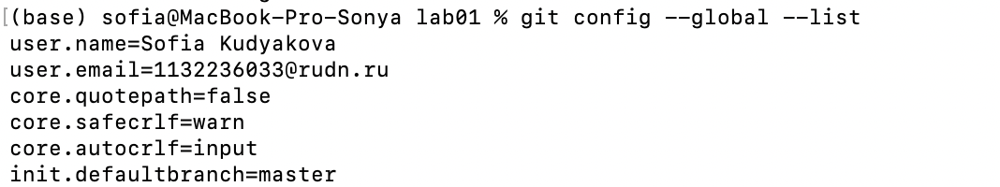{#fig-001 width=70%}

## Настройка SSH-доступа

Для работы с удалёнными Git-репозиториями был настроен доступ по протоколу SSH.

Для создания SSH-ключа используется алгоритм Ed25519. После создания ключа открытая часть ключа добавляется в соответствующий аккаунт удалённого репозитория.

Проверка соединения с удалённым репозиторием позволяет убедиться, что SSH-аутентификация настроена корректно.

Результат настройки SSH представлен на  @fig-002 .

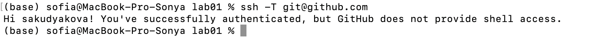{#fig-002 width=70%}

## Настройка GitVerse

В ходе лабораторной работы также была выполнена настройка GitVerse для работы с учебным проектом. После настройки был проверен доступ к репозиторию и возможность взаимодействия с ним через Git.

Настройка GitVerse позволила использовать его в качестве дополнительной платформы для хранения и синхронизации результатов лабораторной работы.

Результат настройки GitVerse представлен на  @fig-333 .

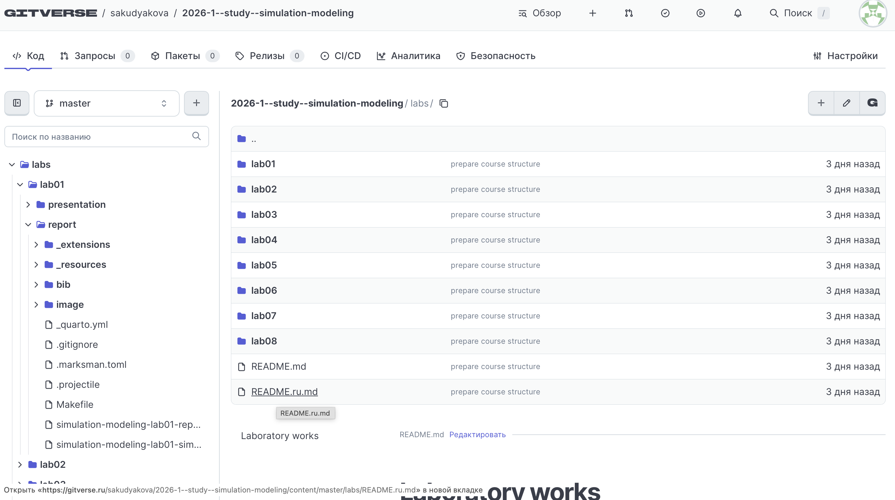{#fig-333 width=70%}

## Создание рабочего пространства курса

В соответствии с методическими указаниями был создан рабочий каталог курса и подготовлена структура лабораторных работ.

Репозиторий курса содержит каталоги отдельных лабораторных работ. Для лабораторной работы №1 используется каталог lab01, внутри которого расположены каталог проекта и каталог отчёта.

Полученная структура соответствует структуре, приведённой в методических указаниях. В ней каталог project содержит вычислительную часть работы, а каталог report предназначен для оформления отчёта. Методичка предусматривает наличие отдельных каталогов для проекта и отчёта.

Результат подготовки рабочего пространства представлен на  @fig-003 .

{#fig-003 width=70%}

## Создание проекта DrWatson

В каталоге лабораторной работы был создан проект Julia с использованием DrWatson.

Проект содержит файлы Project.toml и Manifest.toml, а также каталоги для скриптов, данных, графиков, исходного кода, ноутбуков и документов.

Основные каталоги проекта имеют следующее назначение:

| Каталог | Назначение |
|---|---|
| data/ | результаты вычислительных экспериментов |
| plots/ | графические результаты |
| scripts/ | скрипты вычислений |
| src/ | исходный код проекта |
| notebooks/ | Jupyter Notebook |
| markdown/ | документы Quarto |
| test/ | тесты проекта |

Методические указания приводят аналогичную структуру DrWatson-проекта с каталогами data, scripts, src и другими служебными каталогами.

Полученная структура проекта представлена на @fig-004 .

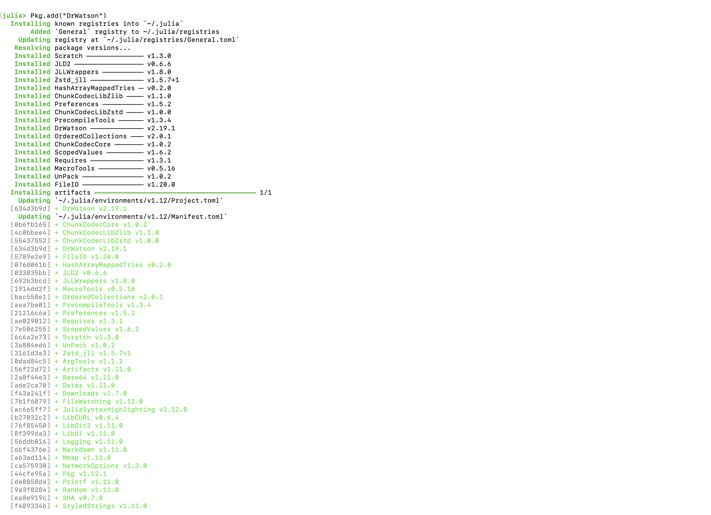{#fig-004 width=70%}

## Установка необходимых пакетов

Для выполнения вычислений были подключены необходимые пакеты Julia:

```julia
using Pkg
Pkg.add("DrWatson")
Pkg.add("DifferentialEquations")
Pkg.add("Plots")
Pkg.add("DataFrames")
Pkg.add("CSV")
Pkg.add("JLD2")
Pkg.add("Literate")
Pkg.add("IJulia")
Pkg.add("BenchmarkTools")
Pkg.add("Quarto")
```

В проекте используются следующие основные пакеты:

- DrWatson — организация вычислительного проекта;
- DifferentialEquations — численное решение дифференциальных уравнений;
- Plots — построение графиков;
- DataFrames — работа с табличными данными;
- JLD2 — сохранение результатов;
- Literate — преобразование литературного кода;
- IJulia — работа с Jupyter Notebook;
- BenchmarkTools — измерение времени вычислений;
- Quarto — подготовка документации.

Перечень пакетов соответствует методическим указаниям лабораторной работы.

Результат установки и загрузки пакетов представлен на  @fig-005 .

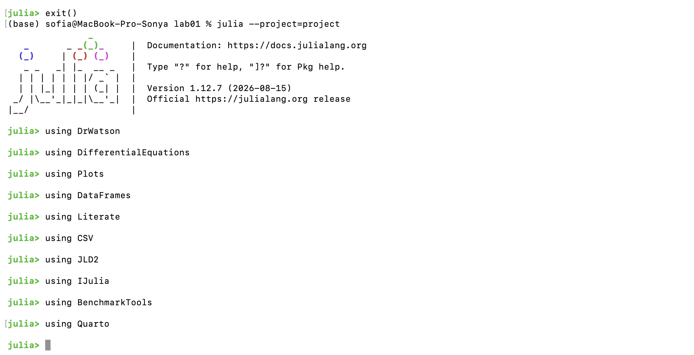{#fig-005 width=70%}

## Проверка проекта

Для проверки корректности окружения был использован скрипт `scripts/test_setup.jl`.

В скрипте выполняется активация проекта:

```julia
using DrWatson
@quickactivate "project"
```

После этого последовательно загружаются необходимые пакеты и проверяются основные пути проекта.

Также выводятся пути к корню проекта, каталогу данных, скриптам и графикам.

Методические указания предлагают выполнять аналогичную проверку с помощью `scripts/test_setup.jl`.

Результат проверки проекта представлен на  @fig-006 .

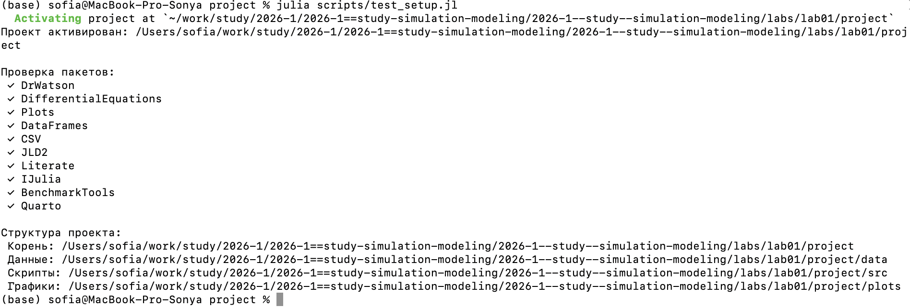{#fig-006 width=70%}

## Моделирование экспоненциального роста

### Реализация модели

На следующем этапе была реализована модель экспоненциального роста.

Функция правой части дифференциального уравнения имеет вид:

```julia
function exponential_growth!(du, u, p, t)
    α = p
    du[1] = α * u[1]
end
```

Она задаёт зависимость скорости изменения величины $u$ от её текущего значения.

Реализация соответствует модели, приведённой в методических указаниях.

### Задание начальных параметров

Для первого эксперимента были выбраны следующие параметры:

```julia
u0 = [1.0]
α = 0.3
tspan = (0.0, 10.0)
```

Начальное значение исследуемой величины равно 1, коэффициент роста равен 0.3, а моделирование проводится на интервале времени от 0 до 10.

После задания параметров формируется задача:

```julia
prob = ODEProblem(exponential_growth!, u0, tspan, α)
sol = solve(prob, Tsit5(), saveat=0.1)
```

Для численного решения используется метод Tsit5(), а результаты сохраняются с шагом 0.1.

Такая постановка соответствует примеру из методических указаний.

### Построение графика
 
После получения численного решения был построен график зависимости $u(t)$ от времени:

```julia
plot(
    sol,
    label="u(t)",
    xlabel="Время t",
    ylabel="Популяция u(t)",
    title="Экспоненциальный рост (α = $α)",
    lw=2,
    legend=:topleft
)
```

График сохраняется с помощью функции savefig.

Результат моделирования при $\alpha=0.3$ представлен на  @fig-007 .

{#fig-007 width=70%}

Полученная траектория имеет характерную для экспоненциального роста форму: с течением времени скорость увеличения величины возрастает.

### Формирование таблицы результатов

Для анализа численного решения была сформирована таблица, содержащая моменты времени и соответствующие значения $u(t)$:

```julia
df = DataFrame(t=sol.t, u=first.(sol.u))
println("Первые 5 строк результатов:")
println(first(df, 5))
```

Таблица позволяет анализировать численные значения решения в отдельных моментах времени.

Результат вывода первых строк таблицы представлен на  @fig-008 .

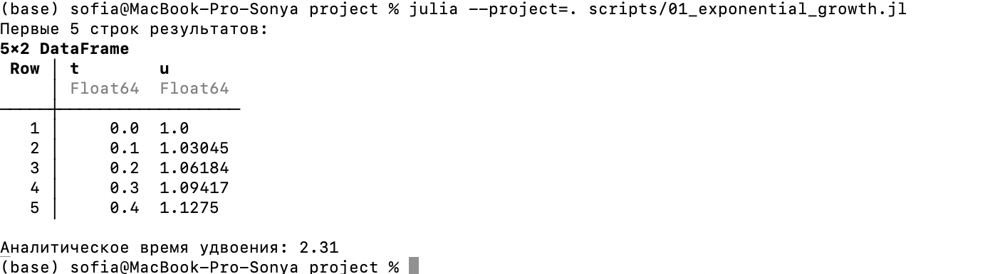{#fig-008 width=70%}

### Расчёт времени удвоения

Время удвоения рассчитывается аналитически по формуле

$$
T_2=\frac{\ln 2}{\alpha}.
$$

В программе используется выражение:

```julia
doubling_time = log(2) / α
```

При $\alpha=0.3$:

$$
T_2=\frac{\ln 2}{0.3}\approx2.31.
$$

Таким образом, при выбранной скорости роста величина модели теоретически увеличивается в два раза примерно за 2.31 единицы времени.

Результат расчёта представлен на  @fig-009 .

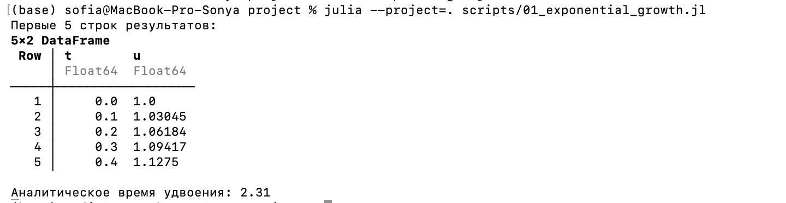{#fig-009 width=70%}

### Сохранение результатов

Полученная таблица результатов сохраняется в формате JLD2:

```julia
@save datadir(script_name, "all_results.jld2") df
```

Использование отдельного файла результатов позволяет сохранить данные моделирования и использовать их в последующем анализе без повторного выполнения эксперимента.

## Литературное программирование

### Литературное описание первого эксперимента

После реализации первоначального скрипта программа была оформлена в литературном стиле.

Литературное программирование позволяет объединять описание вычислительного эксперимента и исполняемый программный код в одном документе.

Для первого эксперимента был создан файл:

`markdown/01_exponential_growth/01_exponential_growth.qmd`.

В нём последовательно представлены:

- инициализация проекта;
- подключение пакетов;
- определение модели;
- задание параметров;
- численное решение;
- визуализация;
- анализ результатов;
- сохранение данных.

Методические указания требуют добавить описание в духе литературного программирования и затем преобразовать его в производные форматы.

Результат создания литературного документа представлен на  @fig-010 .

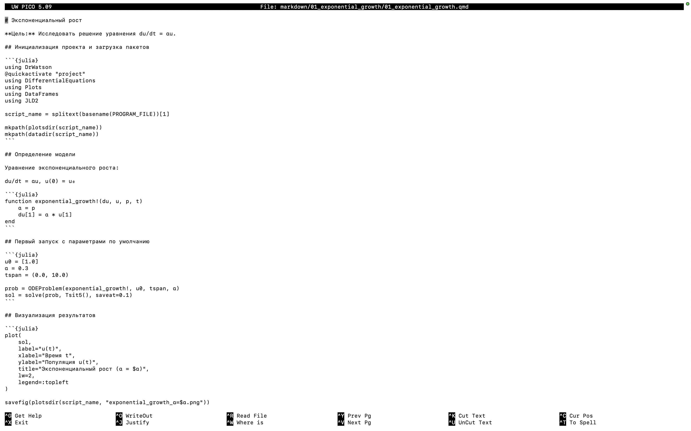{#fig-010 width=70%}

### Генерация производных форматов

Из литературного кода были получены производные представления вычислительного эксперимента.

В проекте подготовлены:

- Julia-скрипт;
- документ Quarto;
- Jupyter Notebook.

Полученные файлы позволяют использовать один исходный материал для выполнения вычислений, документирования и подготовки отчёта.

Результат генерации файлов представлен на  @fig-011 .

{#fig-011 width=70%}

## Параметрическое исследование

### Постановка параметрического эксперимента

После выполнения базового эксперимента было проведено параметрическое исследование влияния коэффициента роста $\alpha$.

Были выбраны следующие значения:

$$
\alpha \in \{0.1,\;0.3,\;0.5,\;0.8,\;1.0\}.
$$

Начальное значение $u_0$, временной интервал и используемый численный метод при этом оставались неизменными.

Параметры экспериментов задаются следующим образом:

```julia
param_grid = Dict(
    :u0 => [[1.0]],
    :α => [0.1, 0.3, 0.5, 0.8, 1.0],
    :tspan => [(0.0, 10.0)],
    :solver => [Tsit5()],
    :saveat => [0.1],
    :experiment_name => ["parametric_scan"]
)
```

С помощью dict_list формируется набор отдельных конфигураций экспериментов.

### Выполнение серии экспериментов

Для каждого набора параметров выполняется численное решение модели.

Для каждого эксперимента сохраняются:

- финальное значение $u(t)$;
- время удвоения;
- параметры эксперимента;
- путь к сохранённому результату.

Результаты объединяются в сводную таблицу results_df.

Результат выполнения параметрического сканирования представлен на  @fig-012 .

{#fig-012 width=70%}

### Сравнение траекторий

Для визуального сравнения были построены траектории модели для всех выбранных значений $\alpha$.

При увеличении $\alpha$ рост становится более быстрым. Поэтому кривые для больших значений коэффициента располагаются выше уже на относительно небольших значениях времени.

Полученный график представлен на  @fig-013 .

{#fig-013 width=70%}

### Зависимость времени удвоения от $\alpha$

Для каждого значения $\alpha$ было вычислено время удвоения.

Кроме численных результатов была построена теоретическая зависимость

$$
T_2=\frac{\ln 2}{\alpha}.
$$

Для этого используется следующий фрагмент программы:

```julia
α_range = 0.1:0.01:1.0
plot!(
    p3,
    α_range,
    log(2) ./ α_range,
    label="Теория: ln(2)/α",
    lw=2,
    linestyle=:dash
)
```

Результат сравнения представлен на  @fig-014 .

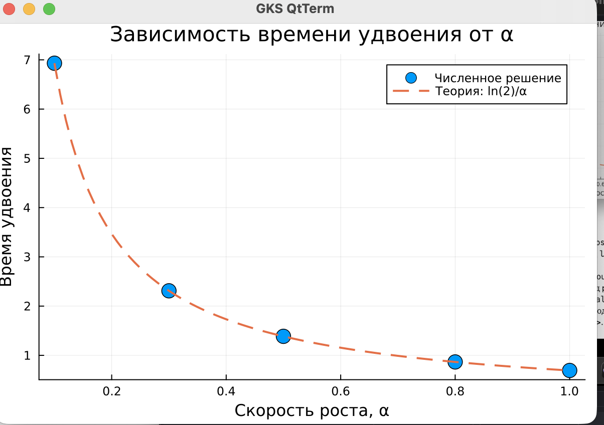{#fig-014 width=70%}

Из графика следует, что при увеличении $\alpha$ время удвоения уменьшается. Полученная зависимость соответствует аналитической формуле.

## Бенчмаркинг

### Измерение времени вычисления

Для дополнительного анализа было выполнено измерение времени выполнения численного решения для различных значений $\alpha$.

Для измерения используется пакет BenchmarkTools.

В каждом случае выполняется серия измерений:

```julia
benchmark = @benchmark $benchmark_run() samples=100 evals=1
time_seconds = median(benchmark).time / 1e9
```

Для каждого значения $\alpha$ вычисляется медианное время выполнения.

Полученные результаты сохраняются в таблицу bench_df.

### График времени вычисления

На основе результатов бенчмаркинга был построен график зависимости времени вычисления от значения $\alpha$.

Полученный график представлен на  @fig-015 .

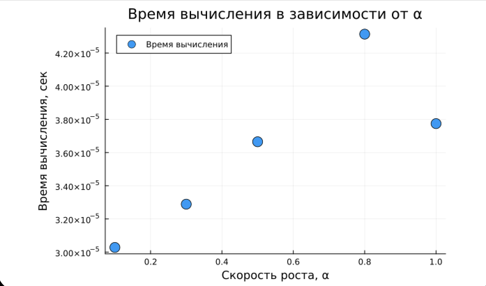{#fig-015 width=70%}

Данный эксперимент позволяет оценить вычислительные затраты численного решения при различных значениях параметра модели.

### Сохранение результатов параметрического исследования

Все результаты параметрического исследования сохраняются в формате JLD2.

Основной файл результатов содержит:

- базовые параметры;
- сетку параметров;
- список всех конфигураций;
- сводную таблицу;
- результаты бенчмаркинга.

Используется следующий код:

```julia
@save datadir(script_name, "all_results.jld2") base_params param_grid all_params results_df bench_df
@save datadir(script_name, "all_plots.jld2") p1 p2 p3 p4
```

Полученные данные позволяют повторно использовать результаты экспериментов без необходимости повторного выполнения всех вычислений.

## Выполнение Jupyter Notebook

В соответствии с методическими указаниями был подготовлен Jupyter Notebook для выполнения вычислительного эксперимента.

В проекте используются ноутбуки:

`notebooks/01_exponential_growth/01_exponential_growth.ipynb`

и

`notebooks/02_exponential_growth/02_exponential_growth.ipynb`.

Ноутбук содержит вычислительные ячейки, описание эксперимента и результаты выполнения.

Результат выполнения `notebooks/01_exponential_growth/01_exponential_growth.ipynb` представлен на @fig-016 . 

А результат выполнения `notebooks/02_exponential_growth/02_exponential_growth.ipynb` на @fig-161 .

{#fig-016 width=70%}


{#fig-161 width=70%}

## Подготовка отчёта Quarto

Для формирования отчёта используется Quarto.

В файле `_quarto.yml` настроена поддержка Julia:

```yaml
engine: julia
julia:
  exeflags: ["--project=../project"]
```

Это позволяет выполнять Julia-код непосредственно при построении документа.

Также в конфигурации отчёта заданы русский язык документа, нумерация разделов, оглавление, списки иллюстраций и таблиц.

Фрагмент конфигурации Quarto представлен на  @fig-017 .

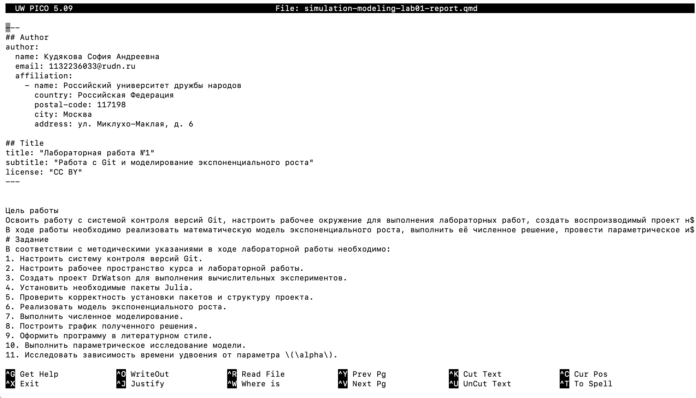{#fig-017 width=70%}

## Итоговая структура лабораторной работы

После выполнения всех этапов была сформирована структура лабораторной работы:

```
lab01/
├── presentation/
├── project/
│   ├── data/
│   ├── markdown/
│   ├── notebooks/
│   ├── plots/
│   ├── scripts/
│   ├── src/
│   ├── test/
│   ├── Project.toml
│   ├── Manifest.toml
│   └── README.md
└── report/
    ├── image/
    ├── _quarto.yml
    └── simulation-modeling-lab01-report.qmd
```

Каталог project содержит вычислительную часть лабораторной работы, а каталог report — материалы для подготовки итогового документа.

Итоговая структура проекта представлена на  @fig-018 .

{#fig-018 width=70%}

# Выводы

В ходе лабораторной работы была выполнена настройка рабочего окружения для проведения вычислительных экспериментов с использованием Git, Julia и DrWatson.

Был создан структурированный проект DrWatson с отдельными каталогами для исходных файлов, скриптов, данных, графиков, ноутбуков и документов.

В рамках вычислительной части была реализована модель экспоненциального роста

$$
\frac{du}{dt}=\alpha u.
$$

Для базового эксперимента использовались начальное значение $u_0=1$, коэффициент роста $\alpha=0.3$ и интервал времени от 0 до 10. Было получено численное решение дифференциального уравнения и построен график экспоненциального роста.

Для базового значения $\alpha=0.3$ аналитическое время удвоения составило приблизительно 2.31.

Также было выполнено параметрическое исследование для значений

$$
\alpha=0.1,\;0.3,\;0.5,\;0.8,\;1.0.
$$

Исследование показало, что увеличение коэффициента $\alpha$ приводит к ускорению роста модели и уменьшению времени удвоения. Полученные результаты сопоставлялись с аналитической зависимостью $T_2=\ln(2)/\alpha$.

Дополнительно был выполнен бенчмаркинг времени вычисления для различных значений параметра.

Результаты вычислений были сохранены в формате JLD2, а исходные вычислительные материалы были подготовлены в виде Julia-скриптов, Quarto-документов и Jupyter Notebook. Таким образом, была сформирована воспроизводимая структура вычислительного проекта.

# Список литературы {.unnumbered}

::: {#refs}
:::

