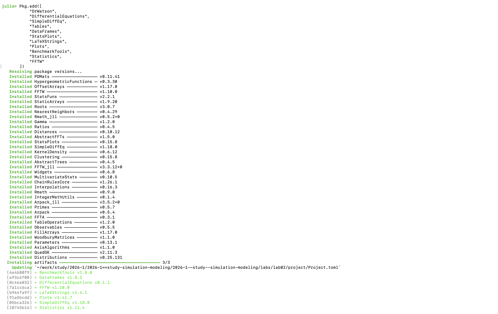
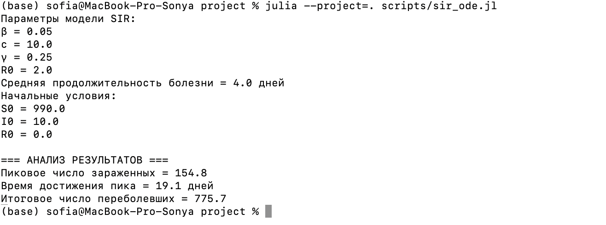
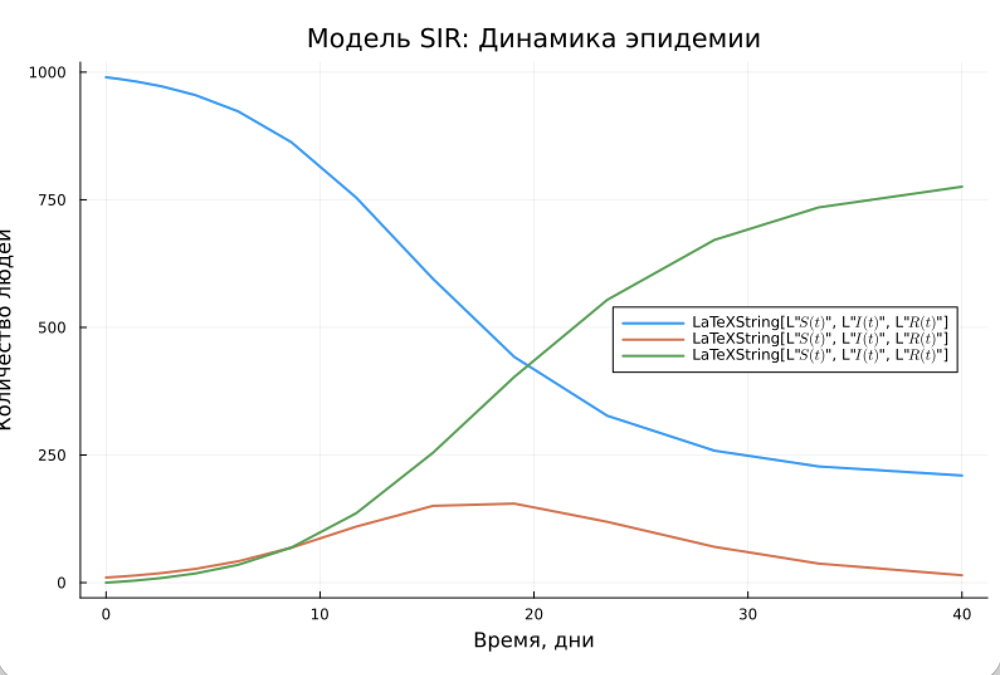
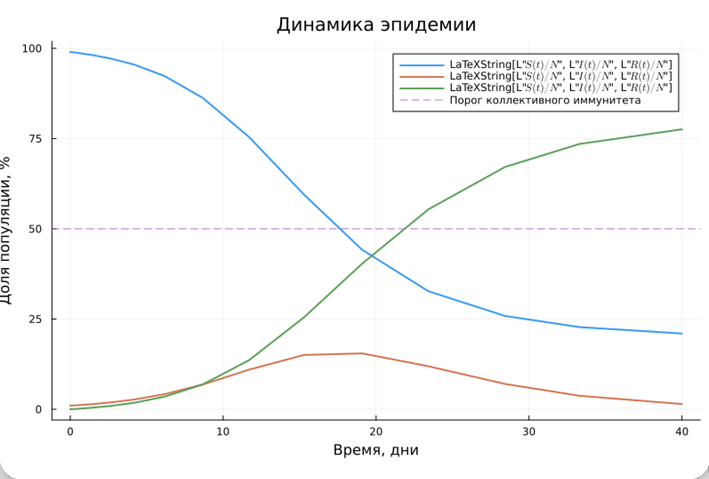
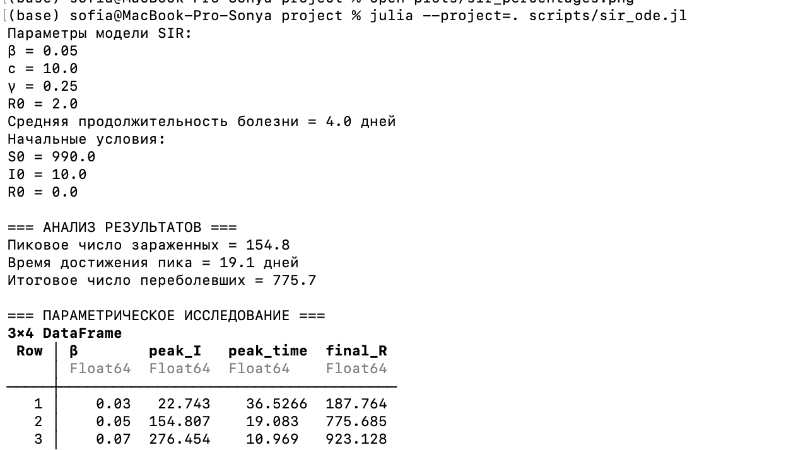
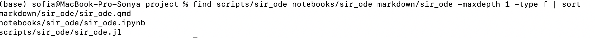
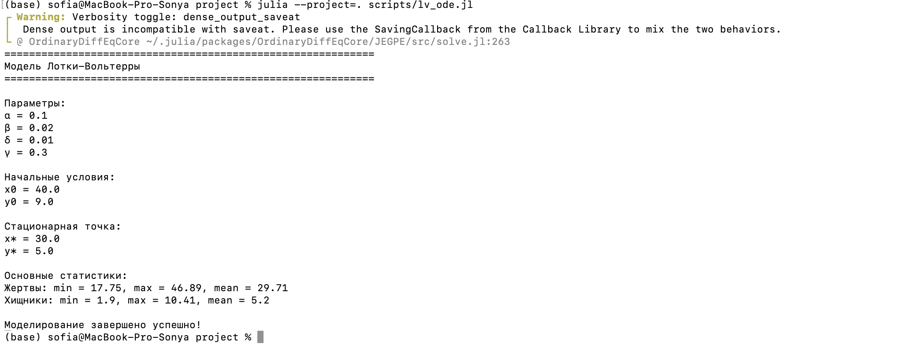
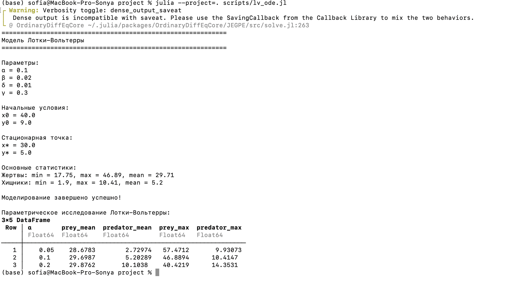

---
## Author
author:
  name: Кудякова София Андреевна
  degrees: студент
  email: 1132236033@rudn.ru
  affiliation:
    - name: Российский университет дружбы народов
      country: Российская Федерация
      postal-code: 117198
      city: Москва
      address: ул. Миклухо-Маклая, д. 6
## Title
title: "Лабораторная работа №2"
subtitle: "Имитационное моделирование"
license: CC BY
date: today
date-format: "2026-08-26"
format:
  beamer:
    pdf-engine: xelatex
    aspectratio: 169
    section-titles: true
    lang: ru
    babel-lang: russian
    babel-otherlangs: english
    keep-tex: true
---

# Вводная часть

## Цель и задачи

**Цель:** познакомиться с моделями SIR и Лотки–Вольтерры, реализовать их средствами Julia, выполнить моделирование и исследовать влияние параметров.

**Задачи:**

- реализовать модели SIR и Лотки–Вольтерры;
- преобразовать код в литературный стиль;
- сгенерировать Julia-скрипт, Jupyter Notebook и Quarto-документ;
- выполнить параметрическое исследование моделей;
- проанализировать полученные результаты.

## Модель SIR

Группы населения: **S** — восприимчивые, **I** — инфицированные, **R** — выздоровевшие.

$$
\frac{dS}{dt} = -\beta c \frac{SI}{N}, \quad
\frac{dI}{dt} = \beta c \frac{SI}{N} - \gamma I, \quad
\frac{dR}{dt} = \gamma I
$$

Базовое репродуктивное число:

$$
R_0 = \frac{\beta c}{\gamma}
$$

## Модель Лотки–Вольтерры

$x$ — численность жертв, $y$ — численность хищников.

$$
\frac{dx}{dt} = \alpha x - \beta xy, \qquad
\frac{dy}{dt} = \delta xy - \gamma y
$$

Модель описывает циклическое изменение численности двух взаимодействующих популяций.

# Подготовка проекта

## Структура проекта

Организация Julia-проекта с отдельными каталогами для кода, notebooks, документов Quarto и графиков.

{#fig-001 width=70%}

## Проверка окружения

Установлены необходимые пакеты Julia, выполнена проверка рабочего окружения.

{#fig-002 width=70%}

# Модель SIR

## Базовая реализация

Параметры модели:

$$
\beta = 0.05,\quad c = 10.0,\quad \gamma = 0.25
$$

Начальные условия:

$$
S_0 = 990,\quad I_0 = 10,\quad R_0 = 0
$$

Базовое репродуктивное число: $R_0 = 2$.

{#fig-003 width=70%}

## Результаты базового эксперимента

- Максимальное число инфицированных: $I_{\max} = 154.8$
- Пик эпидемии: $t_{\text{peak}} \approx 19.1$ дня
- Итоговое число выздоровевших: $R(\infty) = 775.7$

## Графики модели SIR

{#fig-004 width=70%}

{#fig-007 width=70%}

## Параметрическое исследование SIR

Рассмотрены значения:

$$
\beta \in \{0.03,\;0.05,\;0.07\}
$$

| $\beta$ | $I_{\max}$ | $t_{\text{peak}}$ | $R_{\text{final}}$ |
|---|---|---|---|
| 0.03 | 22.7 | 36.5 | 187.8 |
| 0.05 | 154.8 | 19.1 | 775.7 |
| 0.07 | 276.5 | 11.0 | 923.1 |

## Результат параметрического исследования

Увеличение $\beta$ ускоряет распространение инфекции и увеличивает масштаб эпидемии.

{#fig-009 width=70%}

## Производные файлы модели SIR

Из литературного кода сгенерированы:

- Julia-скрипт;
- Jupyter Notebook;
- документ Quarto.

{#fig-010 width=70%}

# Модель Лотки–Вольтерры

## Базовая реализация

Параметры модели:

$$
\alpha = 0.1,\quad \beta = 0.02,\quad \delta = 0.01,\quad \gamma = 0.3
$$

Начальные условия: $x_0 = 40$, $y_0 = 9$.

Стационарная точка: $x^* = 30$, $y^* = 5$.

{#fig-011 width=70%}

## Графики модели Лотки–Вольтерры

{#fig-012 width=70%}

{#fig-013 width=70%}

## Параметрическое исследование Лотки–Вольтерры

Рассмотрены значения:

$$
\alpha \in \{0.05,\;0.1,\;0.2\}
$$

Изменение $\alpha$ влияет на скорость роста популяции жертв и, как следствие, на динамику хищников.

{#fig-017 width=70%}

## Производные файлы модели Лотки–Вольтерры

Из литературного кода сгенерированы Julia-скрипт, Jupyter Notebook и документ Quarto.

{#fig-018 width=70%}

# Jupyter Notebook

## Выполнение Notebook

Результат выполнения Jupyter Notebook для обеих моделей:

{#fig-019 width=70%}

{#fig-020 width=70%}

# Результаты

## Анализ модели SIR

- $R_0 = 2$ при базовых параметрах
- Пик инфицированных $\approx 154.8$ человек на 19.1-й день
- Увеличение $\beta$ ускоряет и усиливает эпидемию

## Анализ модели Лотки–Вольтерры

- Стационарная точка $(x^*, y^*) = (30, 5)$
- Циклические изменения численности жертв и хищников
- Изменение $\alpha$ влияет на скорость роста жертв и динамику хищников

## Выводы

- Реализованы модели SIR и Лотки–Вольтерры на Julia
- Проведено параметрическое исследование обеих моделей
- Освоены литературное программирование, генерация Jupyter Notebook и Quarto-документов
- Получены количественные зависимости влияния параметров на динамику моделей

