---
## Author
author:
  name: Кудякова София Андреевна
  email: 1132236033@rudn.ru
  affiliation:
    - name: Российский университет дружбы народов
      country: Российская Федерация
      postal-code: 117198
      city: Москва
      address: ул. Миклухо-Маклая, д. 6
format:
  pdf:
    pdf-engine: xelatex
    fontsize: 12pt
    geometry:
      - top=30mm
      - left=20mm
      - right=20mm
      - bottom=30mm
    lang: ru
    highlight-style: tango

## Title
title: "Отчёт по лабораторной работе №2"
subtitle: "Имитационное моделирование"
license: "CC BY"
---

# Цель работы

Познакомиться с моделями SIR и Лотки–Вольтерры, реализовать их средствами Julia, выполнить численное моделирование и исследовать влияние параметров моделей на получаемые результаты.

# Задание

В ходе лабораторной работы необходимо:

- создать рабочий каталог для программного кода;
- установить необходимые пакеты;
- выполнить предложенный программный код;
- реализовать модели SIR и Лотки–Вольтерры;
- преобразовать код в литературный стиль;
- сгенерировать из литературного кода:
  - чистый код;
  - Jupyter Notebook;
  - документацию в формате Quarto;
- выполнить код из Jupyter Notebook;
- интегрировать документацию в формате Quarto в отчёт;
- добавить вычисления для набора параметров;
- выполнить параметрическое исследование моделей;
- проанализировать полученные результаты.

# Теоретическое введение

## Модель SIR

Модель SIR является классической математической моделью распространения инфекционного заболевания в закрытой популяции [@kermack1927].

Название модели образовано от трёх групп населения:

- **Susceptible (S)** — восприимчивые к заболеванию;
- **Infectious (I)** — инфицированные;
- **Recovered (R)** — выздоровевшие.

Общая численность популяции определяется выражением:

$$
N = S + I + R.
$$

Модель описывается системой дифференциальных уравнений:

$$
\frac{dS}{dt} = -\beta c \frac{SI}{N},
$$

$$
\frac{dI}{dt} = \beta c \frac{SI}{N} - \gamma I,
$$

$$
\frac{dR}{dt} = \gamma I.
$$

Здесь $\beta$ — вероятность передачи инфекции при контакте, $c$ — среднее число контактов, а $\gamma$ — скорость выздоровления.

Базовое репродуктивное число определяется выражением:

$$
R_0 = \frac{\beta c}{\gamma}.
$$

Если $R_0 > 1$, инфекция может распространяться среди популяции.

Модель позволяет исследовать изменение численности восприимчивых, инфицированных и выздоровевших людей во времени, а также определить пик эпидемии и его момент.

## Модель Лотки–Вольтерры

Модель Лотки–Вольтерры описывает взаимодействие двух популяций: жертв и хищников [@lotka1925; @volterra1926].

Пусть $x$ — численность жертв, а $y$ — численность хищников.

Модель задаётся системой:

$$
\frac{dx}{dt} = \alpha x - \beta xy,
$$

$$
\frac{dy}{dt} = \delta xy - \gamma y.
$$

Здесь:

- $\alpha$ — скорость естественного размножения жертв;
- $\beta$ — коэффициент взаимодействия жертв и хищников;
- $\delta$ — коэффициент преобразования потреблённых ресурсов в прирост хищников;
- $\gamma$ — скорость естественной смертности хищников.

Модель описывает циклическое изменение численности двух взаимодействующих популяций.

При увеличении количества жертв создаются условия для роста популяции хищников. Рост числа хищников, в свою очередь, приводит к уменьшению количества жертв. После уменьшения количества жертв численность хищников также начинает снижаться, что создаёт условия для нового роста популяции жертв.

# Выполнение лабораторной работы

В ходе выполнения лабораторной работы были реализованы модели SIR и Лотки–Вольтерры с использованием языка программирования Julia.

Для организации проекта использовалась структура Julia-проекта с отдельными каталогами для исходного кода, Jupyter Notebook, документов Quarto и графических результатов.

Основная структура проекта имеет вид:

```text
project/
├── markdown/
├── notebooks/
├── plots/
├── scripts/
├── src/
├── Project.toml
└── Manifest.toml
```

Структура рабочего проекта представлена на рисунке @fig-001.

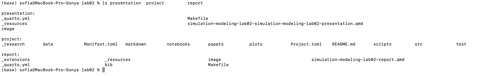{#fig-001 width=70%}

## Подготовка программного окружения

Для выполнения лабораторной работы были установлены необходимые пакеты Julia. После настройки проекта была выполнена проверка рабочего окружения.

Результат проверки представлен на рисунке @fig-002.

{#fig-002 width=70%}

# Модель SIR

## Базовая реализация

Для реализации модели SIR был создан Julia-скрипт `sir_ode.jl`.

В программе задаются параметры модели:

$$
\beta = 0.05,\quad c = 10.0,\quad \gamma = 0.25.
$$

Начальные условия имеют вид:

$$
S_0 = 990,\quad I_0 = 10,\quad R_0 = 0.
$$

Для выбранных параметров базовое репродуктивное число равно:

$$
R_0 = \frac{0.05 \cdot 10}{0.25} = 2.
$$

Средняя продолжительность болезни составляет:

$$
\frac{1}{\gamma} = 4
$$

дня.

Результат выполнения модели SIR представлен на рисунке @fig-003.

{#fig-003 width=70%}

В результате базового эксперимента получено максимальное число инфицированных:

$$
I_{\max} = 154.8.
$$

Пик эпидемии достигается примерно на:

$$
t_{\text{peak}} = 19.1
$$

дня.

Итоговое число выздоровевших составляет:

$$
R(\infty) = 775.7.
$$

## Графики модели SIR

В процессе моделирования были построены графики динамики основных переменных модели.

{#fig-004 width=70%}

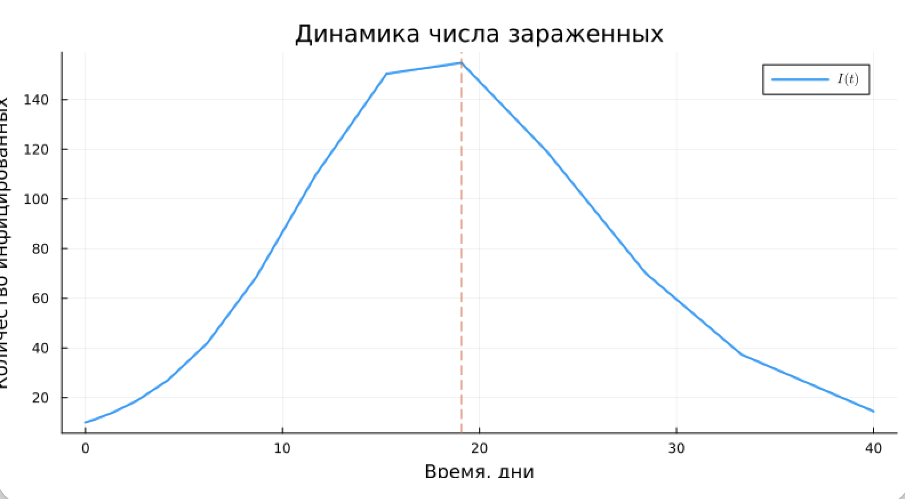{#fig-005 width=70%}

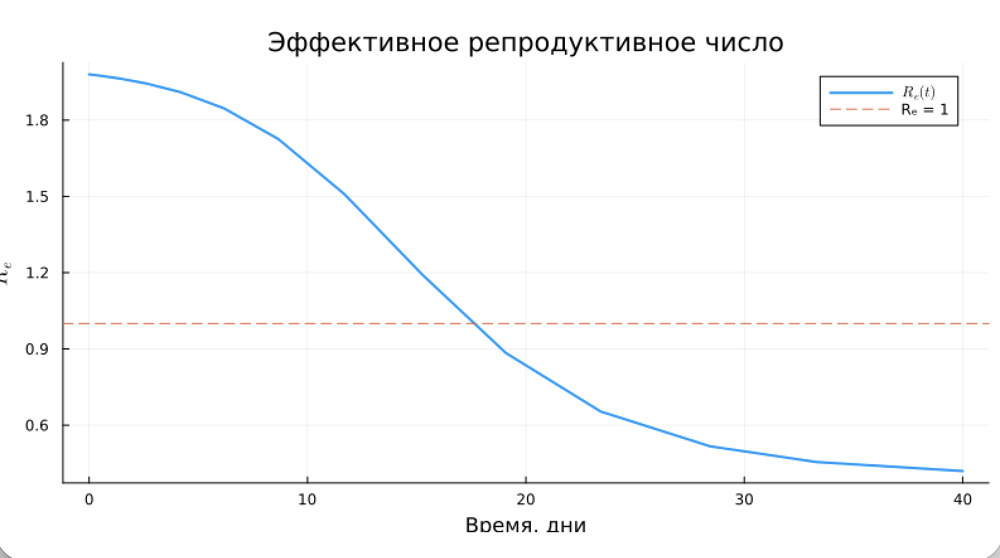{#fig-006 width=70%}

{#fig-007 width=70%}

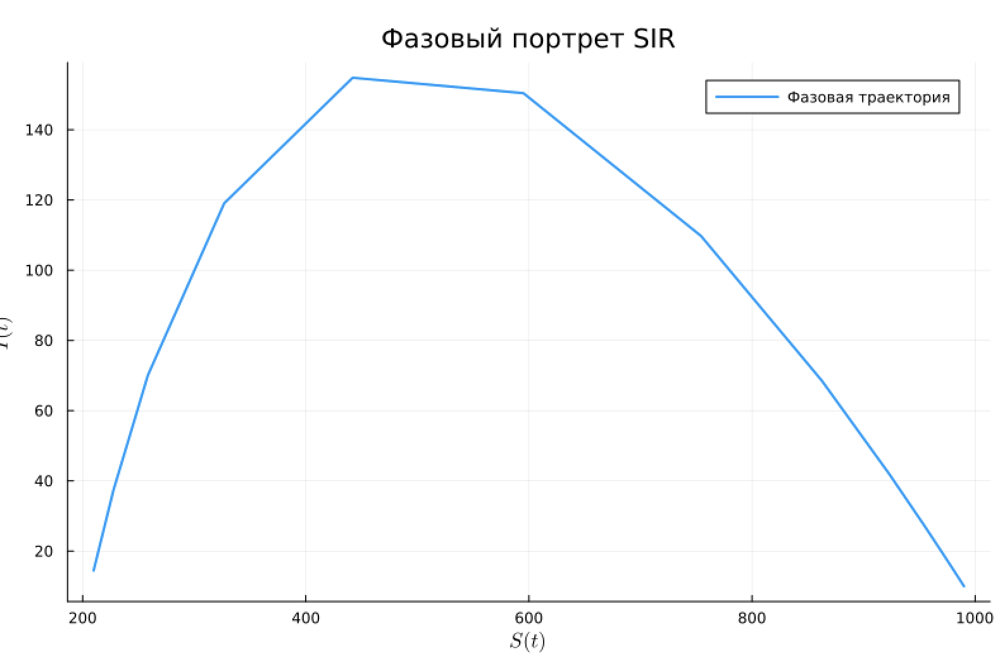{#fig-008 width=70%}

Полученные графики позволяют наблюдать изменение численности трёх групп населения и динамику распространения инфекции.

## Параметрическое исследование модели SIR

Для исследования влияния коэффициента передачи инфекции $\beta$ было выполнено параметрическое исследование.

Рассматривались следующие значения:

$$
\beta \in \{0.03,\;0.05,\;0.07\}.
$$

Для каждого значения параметра рассчитывались:

- максимальное число инфицированных;
- время достижения максимума;
- итоговое число выздоровевших.

Полученные результаты представлены в таблице.

| $\beta$ | $I_{\max}$ | $t_{\text{peak}}$ | $R_{\text{final}}$ |
|---|---|---|---|
| 0.03 | 22.743 | 36.527 | 187.764 |
| 0.05 | 154.807 | 19.083 | 775.685 |
| 0.07 | 276.454 | 10.969 | 923.128 |

Результат параметрического исследования также представлен на рисунке @fig-009.

{#fig-009 width=70%}

Из полученных результатов видно, что увеличение $\beta$ приводит к увеличению максимального числа инфицированных и более раннему достижению пика эпидемии.

При $\beta = 0.03$ максимальное число инфицированных составляет около 22.7 человека, а пик достигается примерно на 36.5-м дне.

При $\beta = 0.05$ максимальное число инфицированных составляет около 154.8 человека, а пик достигается примерно на 19.1-м дне.

При $\beta = 0.07$ максимальное число инфицированных составляет около 276.5 человека, а пик достигается примерно на 11-м дне.

Таким образом, увеличение коэффициента $\beta$ ускоряет распространение инфекции и увеличивает масштаб эпидемии.

## Производные файлы модели SIR

Для литературного кода модели SIR были сформированы производные представления:

- Julia-скрипт;
- Jupyter Notebook;
- документ Quarto.

Файлы модели расположены в следующих каталогах:

```text
scripts/sir_ode/sir_ode.jl
notebooks/sir_ode/sir_ode.ipynb
markdown/sir_ode/sir_ode.qmd
```

Результат генерации производных файлов представлен на рисунке @fig-010.

{#fig-010 width=70%}

# Модель Лотки–Вольтерры

## Базовая реализация

Для реализации модели Лотки–Вольтерры был создан Julia-скрипт `lv_ode.jl`.

В базовом эксперименте использовались параметры:

$$
\alpha = 0.1,\quad \beta = 0.02,\quad \delta = 0.01,\quad \gamma = 0.3.
$$

Начальные условия:

$$
x_0 = 40,\quad y_0 = 9.
$$

Моделирование проводилось на интервале:

$$
t \in [0,200].
$$

Стационарная точка определяется выражениями:

$$
x^* = \frac{\gamma}{\delta}, \qquad y^* = \frac{\alpha}{\beta}.
$$

Для выбранных параметров:

$$
x^* = 30,\quad y^* = 5.
$$

Результат выполнения модели представлен на рисунке @fig-011.

{#fig-011 width=70%}

## Графики модели Лотки–Вольтерры

Для анализа результатов были построены графики динамики популяций, фазового портрета, производных, относительных изменений и спектрального анализа.

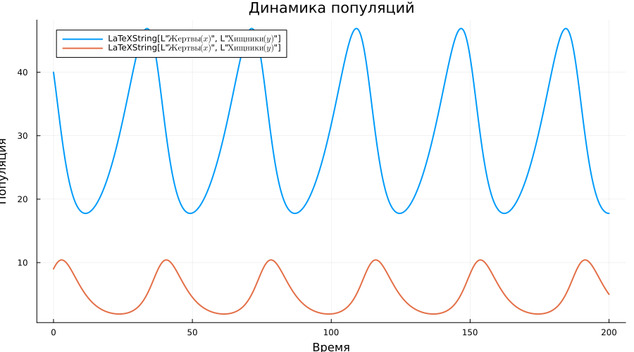{#fig-012 width=70%}

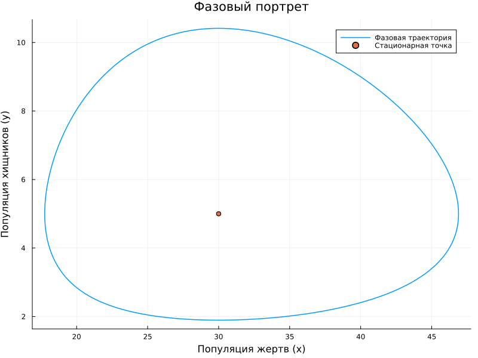{#fig-013 width=70%}

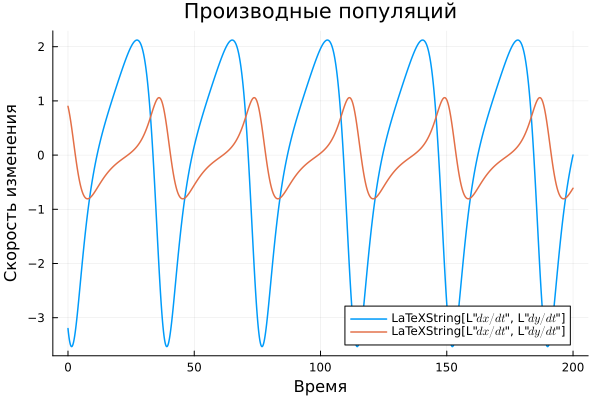{#fig-014 width=70%}

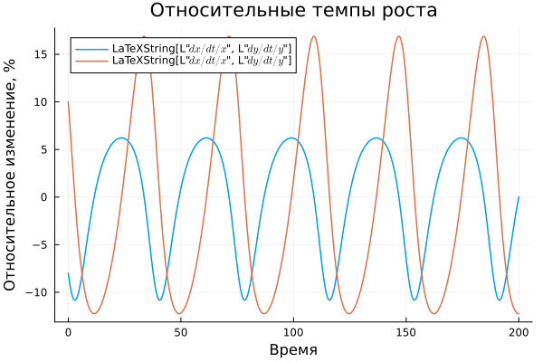{#fig-015 width=70%}

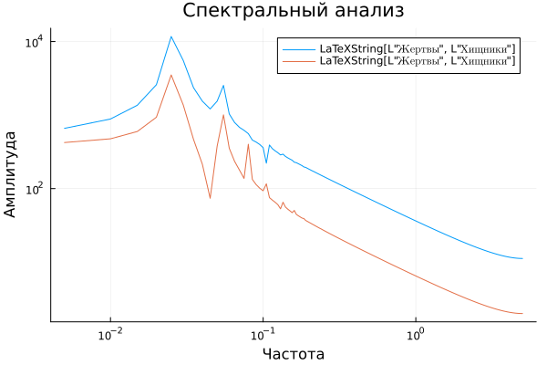{#fig-016 width=70%}

Полученные результаты демонстрируют характерные циклические изменения численности жертв и хищников.

## Параметрическое исследование модели Лотки–Вольтерры

Для исследования влияния скорости естественного размножения жертв $\alpha$ было выполнено параметрическое исследование.

Рассматривались следующие значения:

$$
\alpha \in \{0.05,\;0.1,\;0.2\}.
$$

Для каждого значения $\alpha$ выполнялось отдельное численное решение системы.

В результате для каждого эксперимента определялись:

- средняя численность жертв;
- средняя численность хищников;
- максимальная численность жертв;
- максимальная численность хищников.

Результаты параметрического исследования выводились в виде таблицы.

{#fig-017 width=70%}

Параметрическое исследование позволяет оценить влияние скорости размножения жертв на динамику обеих популяций.

При изменении $\alpha$ изменяется скорость роста популяции жертв, что также влияет на доступность пищи для хищников и, следовательно, на динамику их численности.

## Производные файлы модели Лотки–Вольтерры

Для литературного кода модели Лотки–Вольтерры были сформированы производные представления:

```text
scripts/lv_ode/lv_ode.jl
notebooks/lv_ode/lv_ode.ipynb
markdown/lv_ode/lv_ode.qmd
```

Результат генерации файлов представлен на рисунке @fig-018.

{#fig-018 width=70%}

# Реализация

## Модель SIR

### Базовая реализация



## Модель Лотки–Вольтерры

### Базовая реализация



## Выполнение Jupyter Notebook

После генерации производных файлов были выполнены Jupyter Notebook для обеих моделей.

Для модели SIR использовался файл:

```text
notebooks/sir_ode/sir_ode.ipynb
```

Для модели Лотки–Вольтерры:

```text
notebooks/lv_ode/lv_ode.ipynb
```

Результат выполнения Jupyter Notebook модели SIR представлен на рисунке @fig-019.

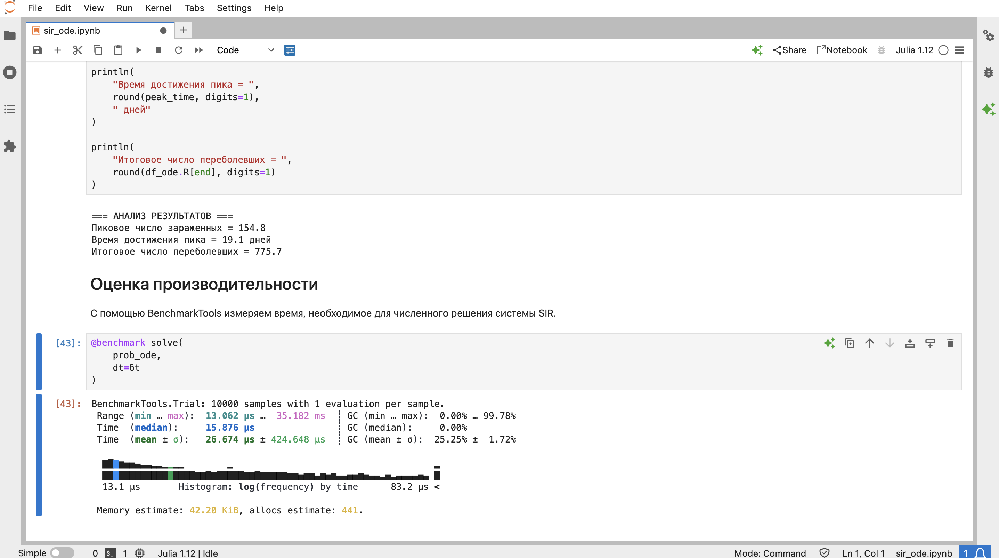{#fig-019 width=70%}

Результат выполнения Jupyter Notebook модели Лотки–Вольтерры представлен на рисунке @fig-020.

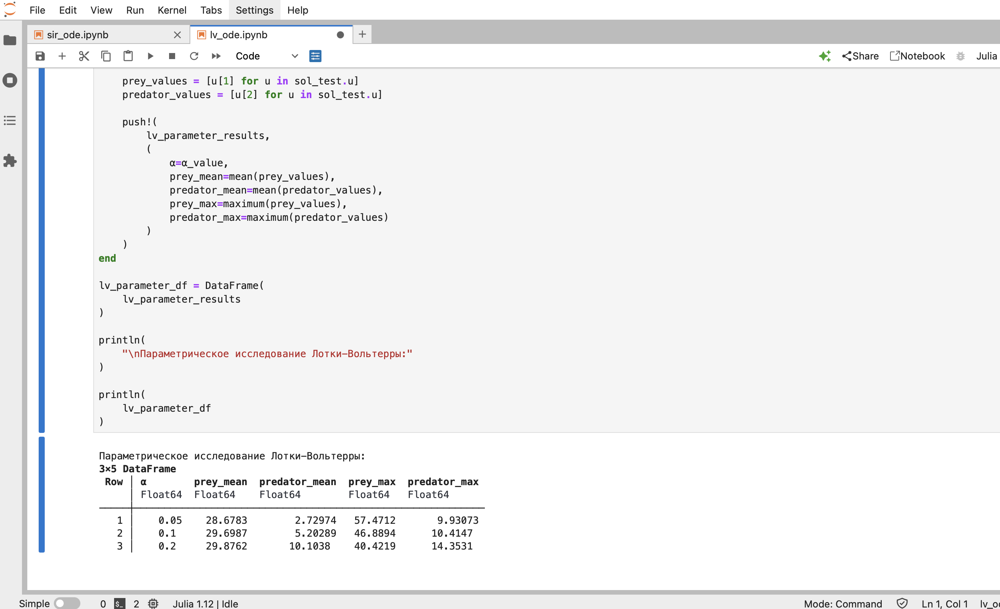{#fig-020 width=70%}

# Литературное программирование

Для преобразования программного кода использовался литературный стиль программирования.

Исходные Julia-скрипты содержат текстовые пояснения в виде комментариев. Это позволяет одновременно использовать их как исполняемые программы и как основу для формирования документации.

Для генерации производных представлений использовался скрипт:

```text
scripts/tangle.jl
```

В результате для моделей были получены Julia-скрипты, Jupyter Notebook и документы Quarto.

# Анализ результатов

## Модель SIR

В базовом эксперименте при

$$
\beta = 0.05,\quad c = 10,\quad \gamma = 0.25
$$

получено:

$$
R_0 = 2.
$$

Пиковое число инфицированных составляет около 154.8 человека, а момент достижения пика — примерно 19.1 дня.

Итоговое число выздоровевших составляет около 775.7 человека.

Параметрическое исследование показало существенное влияние коэффициента $\beta$ на динамику заболевания.

При увеличении $\beta$ максимальное число инфицированных увеличивается, а пик эпидемии достигается раньше.

Таким образом, увеличение интенсивности передачи инфекции приводит к более быстрому и масштабному распространению заболевания.

## Модель Лотки–Вольтерры

В базовом эксперименте при

$$
\alpha = 0.1,\quad \beta = 0.02,\quad \delta = 0.01,\quad \gamma = 0.3
$$

наблюдаются циклические изменения численности жертв и хищников.

Стационарная точка для заданных параметров равна:

$$
(x^*, y^*) = (30, 5).
$$

Полученные графики показывают взаимосвязь между изменением численности двух популяций.

В параметрическом исследовании рассматривались значения:

$$
\alpha \in \{0.05,\;0.1,\;0.2\}.
$$

Изменение $\alpha$ влияет на скорость роста популяции жертв и вследствие взаимодействия между видами отражается на динамике хищников.

# Выводы

В ходе выполнения лабораторной работы были изучены и реализованы две математические модели: SIR и Лотки–Вольтерры.

Для модели SIR было выполнено базовое моделирование и параметрическое исследование коэффициента $\beta$ для значений:

$$
\beta \in \{0.03,\;0.05,\;0.07\}.
$$

Было установлено, что увеличение $\beta$ приводит к увеличению максимального числа инфицированных и более раннему достижению пика эпидемии.

Для модели Лотки–Вольтерры была исследована динамика взаимодействия популяций жертв и хищников. Были построены графики динамики популяций, фазового портрета, производных, относительных изменений и спектрального анализа.

Также было выполнено параметрическое исследование влияния $\alpha$ для значений:

$$
\alpha \in \{0.05,\;0.1,\;0.2\}.
$$

В рамках лабораторной работы были освоены численное решение систем дифференциальных уравнений в Julia, литературное программирование, генерация Jupyter Notebook и документов Quarto, а также проведение параметрических исследований.

# Список литературы {.unnumbered}

::: {#refs}
:::

