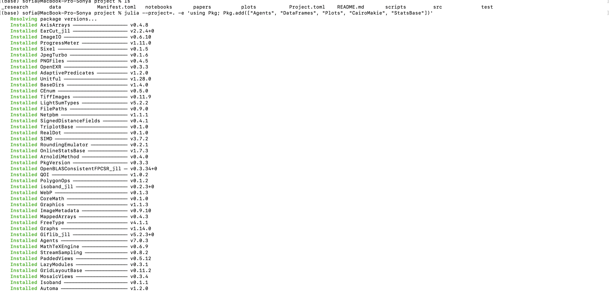
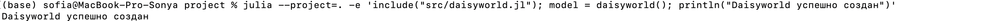
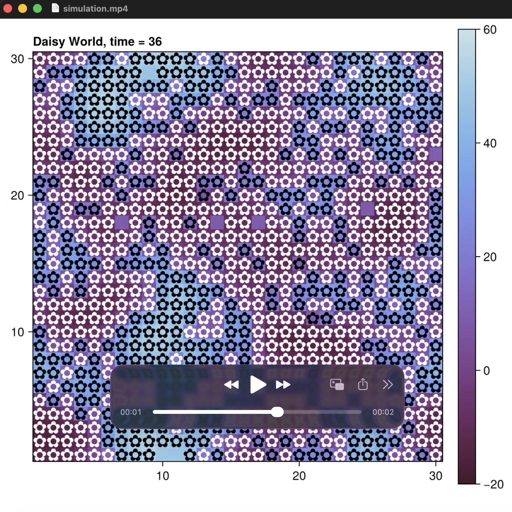
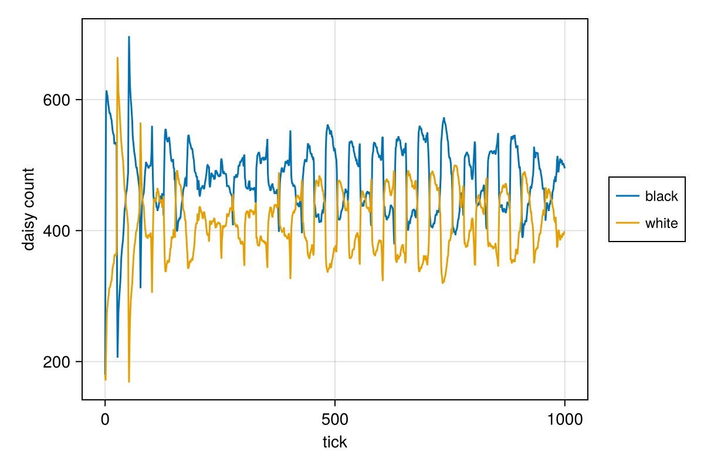
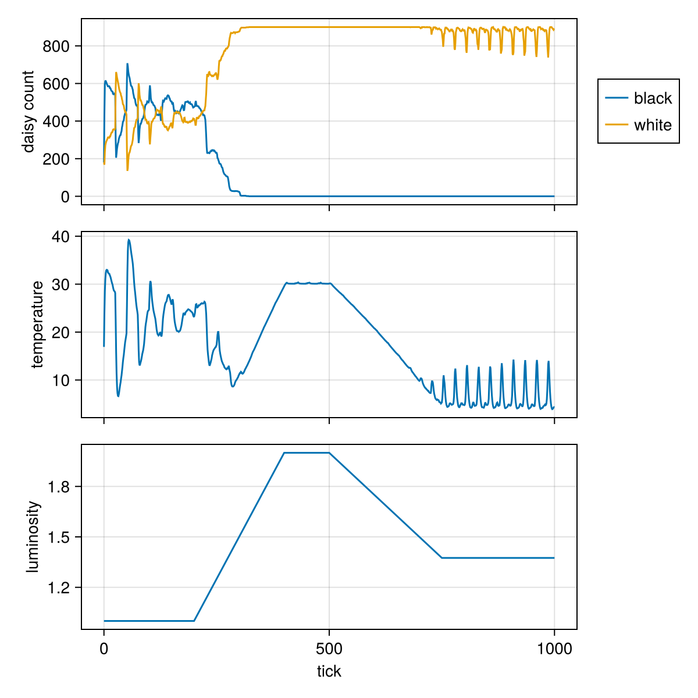
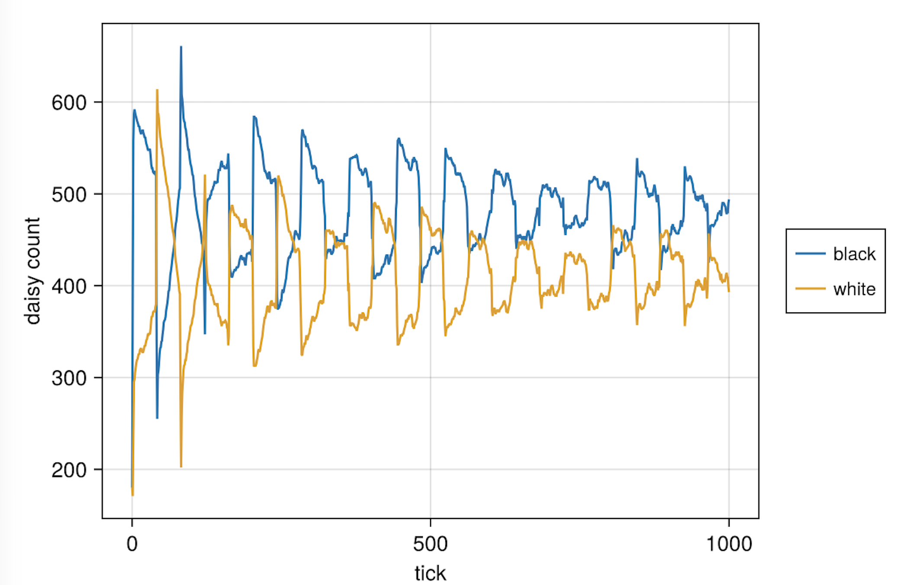
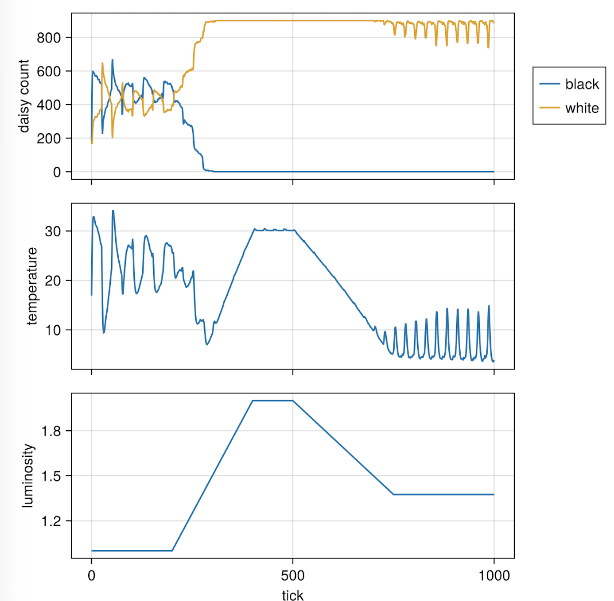
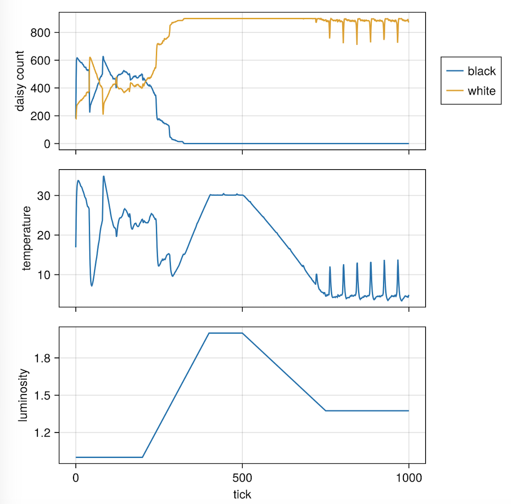
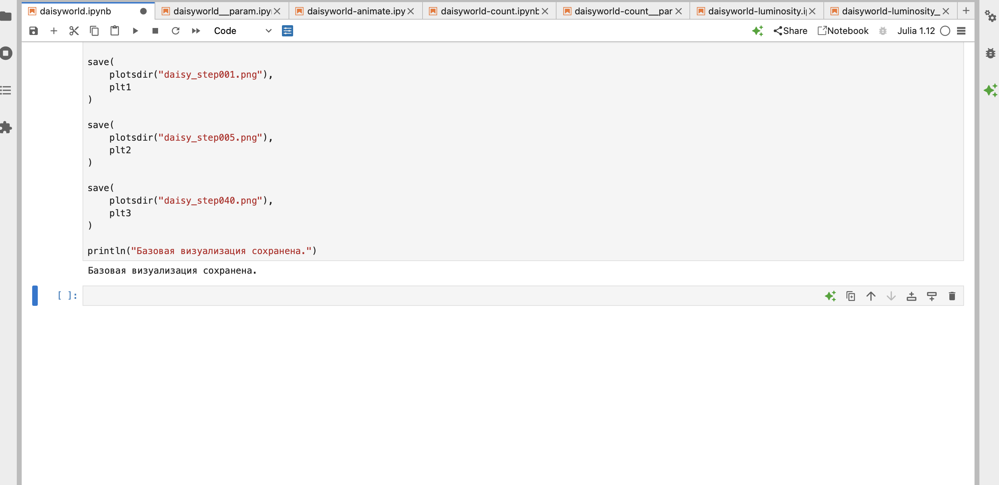
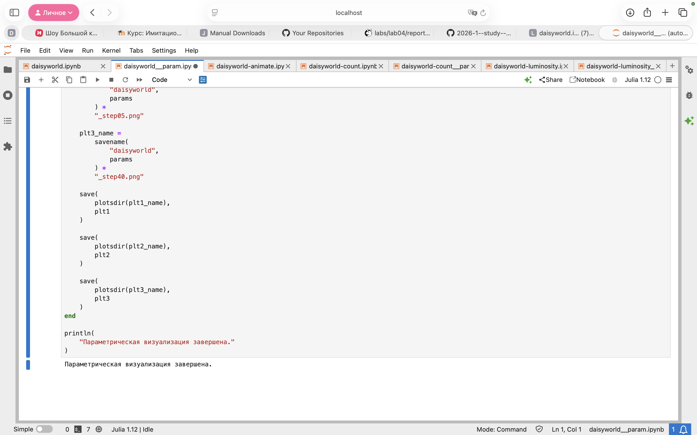

---
## Author
author:
  name: Кудякова София Андреевна
  degrees: студент
  email: 1132236033@rudn.ru
  affiliation:
    - name: Российский университет дружбы народов
      country: Российская Федерация
      postal-code: 117198
      city: Москва
      address: ул. Миклухо-Маклая, д. 6
## Title
title: "Лабораторная работа №3"
subtitle: "Агентное моделирование"
license: CC BY
date: today
date-format: "2026-08-27"
format:
  beamer:
    pdf-engine: xelatex
    aspectratio: 169
    section-titles: true
    lang: ru
    babel-lang: russian
    babel-otherlangs: english
    keep-tex: true
---

# Вводная часть

## Цель и задачи

**Цель:** познакомиться с агентным подходом к имитационному моделированию, реализовать модель DaisyWorld на Julia и исследовать влияние параметров модели.

**Задачи:**

- реализовать модель DaisyWorld;
- преобразовать код в литературный стиль;
- сгенерировать Julia-код, Jupyter Notebook и документ Quarto;
- реализовать визуализацию и анимацию;
- исследовать динамику численности маргариток;
- исследовать влияние солнечной светимости;
- выполнить параметрическое исследование.

## Агентное моделирование

Подход, при котором система представляется как совокупность взаимодействующих автономных агентов.

Основные элементы:

- **агенты** — автономные объекты со своими свойствами;
- **среда** — пространство, в котором находятся агенты;
- **правила взаимодействия** — определяют изменение состояния агентов и среды.

## Модель DaisyWorld

Агентная модель взаимодействия чёрных и белых маргариток со средой.

- чёрные маргаритки — меньшее альбедо, поглощают больше излучения;
- белые маргаритки — отражают больше излучения, охлаждают среду;
- среда — двумерная сетка с температурой в каждой клетке;
- агенты стареют, погибают и размножаются.

Изменение численности маргариток влияет на температуру, а температура — на дальнейшую динамику популяций.

# Подготовка проекта

## Структура проекта

Каталоги: `scripts`, `src`, `markdown`, `notebooks`, `plots`, `data`, `test`.

{#fig-001 width=70%}

## Подготовка рабочего окружения

Установлены необходимые пакеты Julia, выполнена проверка окружения.

{#fig-002 width=70%}

# Реализация модели

## Базовая модель

Реализация в `src/daisyworld.jl`:

- создание агентов;
- расчёт и распространение температуры;
- размножение, старение и гибель маргариток;
- изменение солнечной светимости.

{#fig-003 width=70%}

## Визуализация состояний

Сохранены состояния системы на разных шагах моделирования.

{#fig-004 width=70%}

{#fig-044 width=70%}

{#fig-444 width=70%}

# Анимация

## Динамика во времени

Создана анимация модели DaisyWorld — файл `simulation.mp4`.

{#fig-005 width=70%}

Анимация показывает изменение распределения маргариток и температуры среды во времени.

# Динамика численности

## Изменение количества маргариток

Выполнен длительный запуск модели, построен график динамики чёрных и белых маргариток.

{#fig-006 width=70%}

Динамика популяций определяется взаимодействием агентов со средой и между собой.

# Изменение солнечной светимости

## Сценарий `:ramp`

Солнечная светимость изменяется во времени.

{#fig-007 width=70%}

Изменение светимости меняет условия существования маргариток и влияет на численность обеих популяций.

# Параметрическое исследование

## Исследуемые параметры

- `max_age` — максимальный возраст маргариток;
- `init_white` — начальная доля белых маргариток.

{#fig-008 width=70%}

## Результаты параметрического исследования

{#fig-009 width=70%}

{#fig-099 width=70%}

- изменение `max_age` влияет на скорость смены поколений;
- изменение `init_white` влияет на начальное соотношение популяций и дальнейшую динамику.

## Параметрическое исследование светимости

{#fig-010 width=70%}

{#fig-101 width=70%}

Результаты демонстрируют разное поведение системы при изменении начальных условий и параметров агентов.

# Литературное программирование

## Генерация производных файлов

Из литературного кода получены Julia-скрипты, Jupyter Notebook и документы Quarto.

{#fig-011 width=70%}

{#fig-012 width=70%}

# Jupyter Notebook

## Выполнение Notebook

Сгенерированные Notebook выполнены для проверки воспроизводимости результатов.

{#fig-013 width=70%}

{#fig-014 width=70%}

# Результаты

## Базовое моделирование

- реализована агентная модель DaisyWorld;
- агенты взаимодействуют со средой;
- учитываются температура, возраст и тип маргариток;
- реализованы размножение и гибель агентов.

## Динамика и внешние воздействия

- численность чёрных и белых маргариток изменяется во времени;
- различное альбедо влияет на температуру среды;
- изменение солнечной светимости меняет состояние популяций.

## Параметрическое исследование

- исследовано влияние `max_age` и `init_white`;
- получены результаты для нескольких комбинаций параметров;
- исследовано поведение модели при изменении светимости.

# Выводы

- изучен агентный подход к имитационному моделированию;
- реализована модель DaisyWorld на Julia;
- выполнена визуализация и создана анимация;
- исследована динамика численности маргариток и влияние светимости;
- выполнено параметрическое исследование;
- реализовано литературное программирование;
- сгенерированы и выполнены Julia-скрипты, Jupyter Notebook и Quarto-документы.

