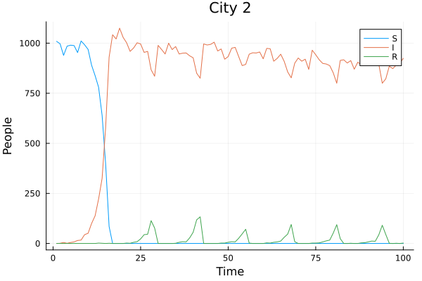
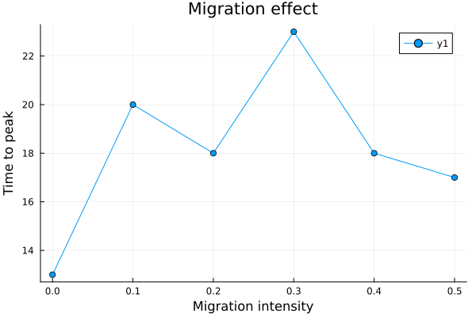
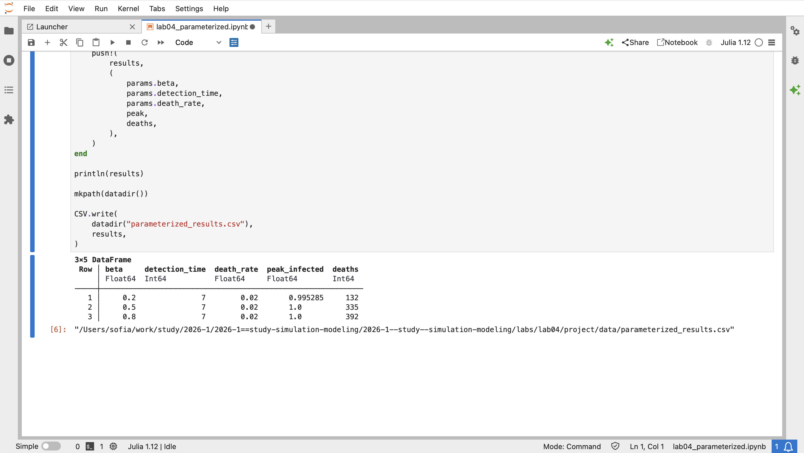

---
## Author
author:
  name: Кудякова София Андреевна
  degrees: студент
  email: 1132236033@rudn.ru
  affiliation:
    - name: Российский университет дружбы народов
      country: Российская Федерация
      postal-code: 117198
      city: Москва
      address: ул. Миклухо-Маклая, д. 6
## Title
title: "Лабораторная работа №4"
subtitle: "Агентная модель SIR"
license: CC BY
date: today
date-format: "2026-08-28"
format:
  beamer:
    pdf-engine: xelatex
    aspectratio: 169
    section-titles: true
    lang: ru
    babel-lang: russian
    babel-otherlangs: english
    keep-tex: true
---

# Введение

## Цель и задачи

**Цель:** реализовать агентную модель SIR на Julia (`Agents.jl`) и исследовать влияние параметров, пространственной структуры, миграции и карантинных мер.

**Задачи:**

- реализовать агентную модель SIR с пространственной структурой из городов;
- реализовать миграцию, передачу инфекции, выздоровление и смертность;
- исследовать порог эпидемии, гетерогенность городов, миграцию, карантин;
- выполнить оптимизацию параметров;
- получить Julia-код, Jupyter Notebook и Quarto-документацию.

# Теоретические сведения

## Классическая и агентная модель SIR

Классическая модель:

$$
\frac{dS}{dt}=-\beta\frac{SI}{N}, \quad
\frac{dI}{dt}=\beta\frac{SI}{N}-\gamma I, \quad
\frac{dR}{dt}=\gamma I
$$

В агентной реализации каждый человек — отдельный агент `Person` (`GraphAgent`) со статусом `:S`, `:I`, `:R` и счётчиком дней болезни.

## Пространственная структура и параметры

- три города на полном графе (каждый связан с двумя другими);
- `Ns = [1000, 1000, 1000]` — население городов;
- `β_und`, `β_det` — вероятность передачи (невыявленные/выявленные);
- `infection_period = 14`, `detection_time = 7`, `death_rate = 0.02`;
- `reinfection_probability = 0.1`, `seed = 42`, `n_steps = 100`;
- миграция задаётся матрицей `migration_rates`.

# Реализация модели

## Логика модели

- **Инициализация:** `initialize_sir` создаёт города, заполняет агентами, один инфицированный стартует в третьем городе.
- **Шаг агента:** миграция → передача инфекции → увеличение дней болезни → выздоровление/смерть.
- **Передача инфекции:** только между агентами в одном городе, интенсивность зависит от статуса выявления.
- **Миграция:** вероятности перехода задаются матрицей `migration_rates`.

# Базовый эксперимент

## Параметры и результат

`scripts/sir_run_basic.jl`, население `[1000,1000,1000]`, $\beta_{und}=0.5$, $\beta_{det}=0.05$, период 14, выявление 7, смертность 0.02, seed 42, 100 шагов.

{#fig-001 width=75%}

Инфекция стартует с одного агента в третьем городе, распространяется, проходит пик и затухает по мере роста числа выздоровевших.

# Порог возникновения эпидемии

## Исследование порога

`scripts/sir_threshold.jl`: $\beta$ от 0.05 до 1.00 с шагом 0.05.

Эпидемия считается возникшей при:

$$
I_{peak}>0.05\cdot3000=150
$$

Теоретический ориентир:

$$
\beta_{threshold}=\frac{1}{14}
$$

Экспериментальный порог сравнивается с теоретической оценкой.

# Гетерогенность городов

## Разные коэффициенты передачи

`scripts/sir_heterogeneity.jl`:

$$
\beta_{und}=[0.2,\;0.5,\;0.8], \qquad \beta_{det}=\frac{\beta_{und}}{10}
$$

Город 1 — низкая скорость передачи, город 2 — средняя, город 3 — высокая.

{#fig-002 width=70%}

{#fig-003 width=70%}

## Город с максимальным $\beta$

{#fig-004 width=75%}

Неоднородность параметров городов приводит к различающейся локальной динамике эпидемии даже при одинаковой численности населения.

# Исследование миграции

## Влияние интенсивности миграции

`scripts/sir_migration_peak.jl`, интенсивность миграции:

$$
0.0,\;0.1,\;0.2,\;0.3,\;0.4,\;0.5
$$

Вероятность остаться в городе — $1-m$, остальное распределяется между другими городами.

{#fig-005 width=75%}

Эксперимент позволяет количественно оценить влияние мобильности населения на скорость распространения эпидемии.

# Карантинные меры

## Сценарии с карантином и без

`scripts/sir_quarantine.jl`: карантин включается при доле инфицированных > 10% в городе — агенты не могут покинуть город.

Критерии эффективности:

- пиковое количество инфицированных;
- общее число умерших.

# Оптимизация параметров

## Минимизация смертности

`scripts/sir_optimize_constrained.jl`, ограничение:

$$
I_{peak}<0.30
$$

Оптимизируемые параметры:

- $\beta \in [0.1, 1.0]$;
- `detection_time` $\in [3, 14]$;
- `death_rate` $\in [0.01, 0.1]$.

Использован пакет `BlackBoxOptim`; цель — минимальная смертность при соблюдении ограничения на пик.

# Параметризованное исследование

## Сравнение наборов параметров

`scripts/lab04_parameterized.jl`:

| $\beta$ | detection_time | death_rate |
|---:|---:|---:|
| 0.2 | 7 | 0.02 |
| 0.5 | 7 | 0.02 |
| 0.8 | 7 | 0.02 |

Для каждого набора: пиковая доля инфицированных и число умерших. Увеличение $\beta$ усиливает распространение и итоговые эпидемиологические показатели.

# Литературное программирование

## Генерация форматов

Из литературных файлов `lab04_additional.jl` и `lab04_parameterized.jl` получены Julia-код, Quarto-документ и Jupyter Notebook для каждого эксперимента.

## Jupyter Notebook

Выполнены `lab04_additional.ipynb` и `lab04_parameterized.ipynb`.

{#fig-006 width=75%}

# Структура проекта

## Итоговая структура

```text
project/
├── data/
├── notebooks/
├── plots/
├── report/
├── scripts/
├── src/
└── test/
```

Модель — `src/sir_model.jl`; эксперименты — `sir_threshold.jl`, `sir_heterogeneity.jl`, `sir_migration_peak.jl`, `sir_quarantine.jl`, `sir_optimize_constrained.jl`.

# Результаты и выводы

## Что сделано

- реализована агентная модель SIR с тремя городами;
- исследованы порог эпидемии, гетерогенность, миграция, карантин;
- выполнена оптимизация параметров;
- проведено параметризованное исследование;
- сгенерированы Julia-код, Quarto и Jupyter Notebook.

## Заключение

Агентный подход позволил учесть отдельных участников эпидемии и пространственную структуру из трёх городов с миграцией.

Исследованы влияние неоднородности параметров, интенсивности миграции и карантинных ограничений, выполнена оптимизация с ограничением на пик заболеваемости.

Литературное программирование обеспечило воспроизводимость: один источник — Julia-код, Quarto-документация и Jupyter Notebook.

