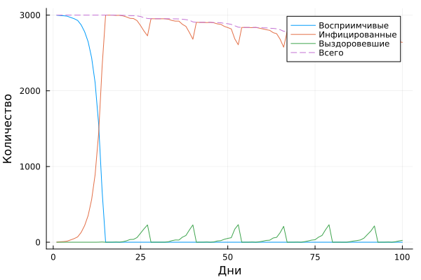
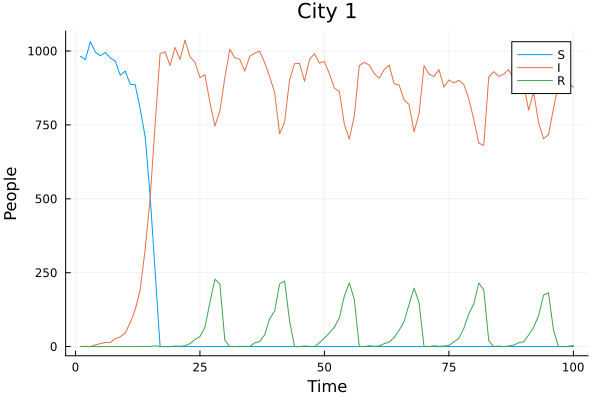
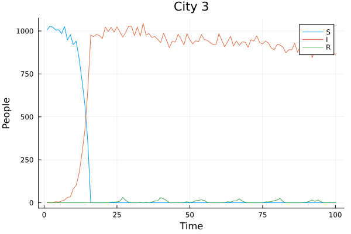

---
## Author
author:
  name: Кудякова София Андреевна
  degrees: студент
  email: 1132236033@rudn.ru
  affiliation:
    - name: Российский университет дружбы народов
      country: Российская Федерация
      postal-code: 117198
      city: Москва
      address: ул. Миклухо-Маклая, д. 6

## Title
title: "Лабораторная работа №3"
subtitle: "Агентное моделирование"
license: CC BY

format:
  beamer:
    pdf-engine: xelatex
    aspectratio: 169
    section-titles: true
    lang: ru
    babel-lang: russian
    babel-otherlangs: english
    keep-tex: true
---

# Введение

## Цель работы

Целью лабораторной работы является реализация эпидемиологической модели SIR в агентном подходе с использованием языка Julia и пакета `Agents.jl`, а также исследование влияния параметров модели, пространственной структуры, миграции и дополнительных мер управления распространением инфекции.

В отличие от классической компартментальной модели, агентный подход позволяет рассматривать популяцию как совокупность отдельных взаимодействующих агентов. Для каждого агента можно хранить индивидуальное состояние, положение в пространстве и историю заболевания.

## Задачи работы

В рамках лабораторной работы необходимо:

- реализовать агентную модель SIR;
- задать пространственную структуру из нескольких городов;
- реализовать перемещение агентов между городами;
- реализовать передачу инфекции;
- реализовать выздоровление и смертность;
- выполнить базовый запуск модели;
- исследовать порог возникновения эпидемии;
- исследовать влияние неоднородности параметров между городами;
- исследовать влияние интенсивности миграции;
- реализовать карантинные меры;
- выполнить оптимизацию параметров модели;
- реализовать параметризованные вычисления;
- получить чистый Julia-код, Jupyter Notebook и Quarto-документацию средствами литературного программирования.

Методика лабораторной работы предусматривает именно такой переход от базовой модели к пространственной агентной модели и дальнейшее исследование параметров. simulation-modeling-lab-3.pdf

# 1. Теоретические сведения

## 1.1. Классическая модель SIR

Классическая модель SIR разделяет население на три основные группы:

- $S$ — восприимчивые к инфекции;
- $I$ — инфицированные;
- $R$ — выздоровевшие.

Динамика классической модели описывается системой:

$$
\frac{dS}{dt}=-\beta\frac{SI}{N},
$$

$$
\frac{dI}{dt}=\beta\frac{SI}{N}-\gamma I,
$$

$$
\frac{dR}{dt}=\gamma I.
$$

Здесь $\beta$ характеризует интенсивность передачи инфекции, а $\gamma$ — скорость выздоровления. simulation-modeling-lab-3.pdf

В рассматриваемой работе используется агентная реализация этой идеи. Каждый человек представлен отдельным агентом, а его состояние хранится непосредственно в модели.

## 1.2. Агентная модель

Для реализации агента используется структура `Person`, унаследованная от `GraphAgent`. Для каждого агента хранятся:

- количество дней с момента заражения `days_infected`;
- состояние `status`, принимающее значения `:S`, `:I` или `:R`.

Основная структура агента реализована в файле:

`project/src/sir_model.jl`.

Именно этот файл содержит основную логику агентной SIR-модели. simulation-modeling-lab-3.pdf

## 1.3. Пространственная структура

Агенты располагаются на графе, вершины которого соответствуют городам, а рёбра задают возможные перемещения между ними.

В используемой реализации создаётся полный граф, поэтому каждый из трёх городов связан с двумя другими городами. simulation-modeling-lab-3.pdf

Таким образом, модель позволяет исследовать не только временную динамику эпидемии, но и пространственное распространение инфекции.

## 1.4. Параметры модели

В модели используются следующие параметры:

- `Ns = [1000, 1000, 1000]` — численность населения трёх городов;
- `β_und` — вероятность передачи инфекции невыявленными инфицированными;
- `β_det` — вероятность передачи инфекции выявленными инфицированными;
- `infection_period = 14` — продолжительность заболевания;
- `detection_time = 7` — время до выявления;
- `death_rate = 0.02` — вероятность летального исхода;
- `reinfection_probability = 0.1` — вероятность повторного заражения;
- `Is = [0, 0, 1]` — начальное число инфицированных;
- `seed = 42` — начальное значение генератора случайных чисел;
- `n_steps = 100` — продолжительность базовой симуляции.

Миграция задаётся матрицей `migration_rates`. Методика предусматривает именно такую пространственную интерпретацию параметров модели. simulation-modeling-lab-3.pdf

# 2. Реализация модели

## 2.1. Инициализация

Функция `initialize_sir` создаёт модель, граф пространства и заполняет города агентами.

Для каждого города создаются агенты со статусом `:S`, после чего заданное количество агентов переводится в состояние `:I`. Начальный инфицированный агент в эксперименте располагается в третьем городе.

Для воспроизводимости экспериментов используется фиксированное значение `seed = 42`.

## 2.2. Шаг агента

На каждом шаге модели для инфицированного агента выполняются следующие действия:

1. миграция между городами;
2. передача инфекции;
3. увеличение счётчика дней заболевания;
4. выздоровление или смерть.

Такая последовательность непосредственно соответствует логике, заданной в методике лабораторной работы. simulation-modeling-lab-3.pdf

## 2.3. Передача инфекции

Если агент находится в состоянии `:I`, он может передавать инфекцию восприимчивым агентам, находящимся в том же городе.

При этом интенсивность передачи зависит от состояния выявления заболевшего агента.

## 2.4. Миграция

Для каждого агента предусмотрена возможность перемещения между городами.

Вероятности перехода задаются матрицей `migration_rates`. Таким образом, изменение интенсивности миграции позволяет исследовать, насколько пространственная мобильность населения влияет на скорость распространения эпидемии.

# 3. Базовый эксперимент

Базовый эксперимент реализован в файле:

`scripts/sir_run_basic.jl`.

Для него использовались следующие параметры:

| Параметр | Значение |
|---|---:|
| Население городов | `[1000, 1000, 1000]` |
| $\beta_{und}$ | `0.5` |
| $\beta_{det}$ | `0.05` |
| Период инфекции | `14` |
| Время выявления | `7` |
| Смертность | `0.02` |
| Повторное заражение | `0.1` |
| Начальные инфицированные | `[0, 0, 1]` |
| Seed | `42` |
| Число шагов | `100` |

В результате выполнения эксперимента были сохранены данные модели:

- `data/sir_basic_agent.jld2`;
- `data/sir_basic_model.jld2`;

а также график:

`plots/sir_basic_dynamics.png`.

{#fig-001 width=85%}

На графике показано изменение количества восприимчивых, инфицированных и выздоровевших агентов во времени.

В начале эксперимента заражён только один агент в третьем городе. По мере выполнения симуляции инфекция распространяется среди восприимчивых агентов. После прохождения пика количество инфицированных уменьшается, а количество выздоровевших увеличивается.

# 4. Порог возникновения эпидемии

Для исследования порога был создан скрипт:

`scripts/sir_threshold.jl`.

В эксперименте значение $\beta$ изменялось от `0.05` до `1.00` с шагом `0.05`.

Для каждого значения рассчитывалось максимальное число инфицированных. Эпидемия считалась возникшей, если пиковая численность инфицированных превышала 5% населения.

При общей численности населения 3000 человек это соответствует условию:

$$
I_{peak}>0.05\cdot3000=150.
$$

Результаты сохранялись в:

`data/sir_threshold.csv`.

Дополнительно программа определяет первое значение $\beta$, при котором выполняется критерий возникновения эпидемии.

Теоретический ориентир в используемой реализации определяется через продолжительность инфекционного периода:

$$
\beta_{threshold}=\frac{1}{14}.
$$

Полученный экспериментальный порог позволяет сравнить поведение стохастической агентной модели с теоретической оценкой.

# 5. Гетерогенность городов

Следующим этапом было исследование неоднородности параметров между городами.

Эксперимент реализован в:

`scripts/sir_heterogeneity.jl`.

Для трёх городов были заданы разные значения коэффициента передачи:

$$
\beta_{und}=[0.2,\;0.5,\;0.8].
$$

Таким образом:

- город 1 имеет низкую скорость передачи;
- город 2 — среднюю;
- город 3 — высокую.

Для выявленных случаев использовалось:

$$
\beta_{det}=\frac{\beta_{und}}{10}.
$$

Результаты сохранялись в:

`data/sir_heterogeneity.csv`.

Для каждого города были построены отдельные графики.

{#fig-002 width=85%}

На первом графике показана динамика восприимчивых, инфицированных и выздоровевших агентов в городе с наиболее низким значением $\beta$.

{#fig-003 width=85%}

Во втором городе используется промежуточное значение коэффициента передачи, поэтому динамика распространения инфекции отличается от первого города.

{#fig-004 width=85%}

В третьем городе значение $\beta$ максимально. Поэтому инфекция распространяется быстрее.

Полученный эксперимент показывает, что неоднородность параметров отдельных территорий приводит к различающейся локальной динамике эпидемии даже при одинаковой численности населения городов.

# 6. Исследование миграции

Влияние миграции исследовалось с помощью:

`scripts/sir_migration_peak.jl`.

Для эксперимента использовались значения интенсивности миграции:

$$
0.0,\;0.1,\;0.2,\;0.3,\;0.4,\;0.5.
$$

Матрица миграции строилась так, чтобы вероятность остаться в текущем городе была равна:

$$
1-m,
$$

где $m$ — интенсивность миграции.

Оставшаяся вероятность распределялась между двумя другими городами.

Для каждого значения миграции определялись:

- пиковое число инфицированных;
- время достижения пика.

Результаты сохранялись в:

`data/sir_migration_peak.csv`.

{#fig-005 width=85%}

На основе полученной таблицы определяется интенсивность миграции, соответствующая минимальному времени достижения пика.

Таким образом, эксперимент позволяет количественно оценить влияние мобильности населения на скорость распространения эпидемии.

# 7. Карантинные меры

Для исследования карантина использовался:

`scripts/sir_quarantine.jl`.

В эксперименте сравнивались два сценария:

- без карантина;
- с карантином.

Начальные параметры обоих сценариев одинаковы.

Карантин включался, если доля инфицированных в конкретном городе превышала 10%.

При выполнении условия соответствующая строка матрицы миграции изменялась таким образом, что агенты больше не могли покидать данный город.

Результаты сохранялись в:

`data/sir_quarantine.csv`.

Критерием эффективности карантина являлось сравнение:

- пикового количества инфицированных;
- общего числа умерших.

Таким образом, введение карантинного ограничения позволяет оценить влияние ограничения мобильности на распространение инфекции.

# 8. Оптимизация параметров

Оптимизационный эксперимент реализован в:

`scripts/sir_optimize_constrained.jl`.

Целью являлось минимизировать общее число умерших при сохранении пика заболеваемости ниже 30% населения.

Таким образом, ограничение имело вид:

$$
I_{peak}<0.30.
$$

Оптимизировались три параметра:

- $\beta$ в диапазоне `[0.1, 1.0]`;
- `detection_time` в диапазоне `[3, 14]`;
- `death_rate` в диапазоне `[0.01, 0.1]`.

Для каждого набора параметров выполнялось несколько повторных симуляций, после чего рассчитывались средние значения пиковой заболеваемости и смертности.

В качестве оптимизационного инструмента использовался пакет `BlackBoxOptim`.

Полученный результат сохранялся в:

`data/optimization_constrained_result.jld2`.

Оптимизационный эксперимент позволяет найти такой набор параметров модели, при котором количество умерших минимально при соблюдении ограничения на пик эпидемии.

# 9. Параметризованное исследование

Отдельно было выполнено параметризованное исследование в файле:

`scripts/lab04_parameterized.jl`.

Были исследованы три набора параметров:

| $\beta$ | `detection_time` | `death_rate` |
|---:|---:|---:|
| 0.2 | 7 | 0.02 |
| 0.5 | 7 | 0.02 |
| 0.8 | 7 | 0.02 |

Для каждого набора запускалась отдельная агентная симуляция.

В качестве результатов рассчитывались:

- пиковая доля инфицированных;
- число умерших.

Результаты сохранялись в:

`data/parameterized_results.csv`.

Параметризованный эксперимент позволяет сравнить поведение модели при различных значениях основного коэффициента передачи инфекции.

При увеличении $\beta$ ожидается более интенсивное распространение инфекции, что отражается на величине пика заражённых и итоговых эпидемиологических показателях.

# 10. Литературное программирование

В лабораторной работе использовался подход литературного программирования.

Основной дополнительный литературный файл:

`scripts/lab04_additional.jl`.

Из него были получены несколько представлений одного и того же исследования:

- чистый Julia-код;
- Quarto-документ;
- Jupyter Notebook.

Производные файлы находятся в:

```text
scripts/generated/lab04_additional.jl
report/lab04_additional.qmd
notebooks/lab04_additional.ipynb
```

Аналогично для параметризованного эксперимента были получены:

```text
scripts/generated/lab04_parameterized.jl
report/lab04_parameterized.qmd
notebooks/lab04_parameterized.ipynb
```

Таким образом, один литературный источник используется для получения нескольких форматов представления результатов.

Методика лабораторной работы непосредственно требует генерации чистого кода, Jupyter Notebook и Quarto-документации, а также выполнения параметризованного Notebook. simulation-modeling-lab-3.pdf

# 11. Jupyter Notebook

В проекте находятся два Notebook:

```text
notebooks/lab04_additional.ipynb
notebooks/lab04_parameterized.ipynb
```

Первый содержит дополнительное исследование агентной SIR-модели.

Второй предназначен для выполнения параметризованного эксперимента.

Выполнение Notebook позволяет получить результаты вычислений непосредственно в интерактивной среде Jupyter.

{#fig-006 width=85%}

# 12. Структура проекта

Итоговая структура проекта содержит исходный код модели, экспериментальные скрипты, данные, графики, Notebook и Quarto-документацию.

Основные каталоги:

```text
project/
├── data/
├── notebooks/
├── plots/
├── report/
├── scripts/
├── src/
└── test/
```

В каталоге `data/` находятся результаты проведённых экспериментов, в `plots/` — построенные графики, в `notebooks/` — Jupyter Notebook, а в `scripts/` — исходные Julia-скрипты.

Основная модель расположена в:

```text
src/sir_model.jl
```

Дополнительные исследования реализованы отдельными скриптами:

```text
scripts/sir_threshold.jl
scripts/sir_heterogeneity.jl
scripts/sir_migration_peak.jl
scripts/sir_quarantine.jl
scripts/sir_optimize_constrained.jl
```

# 13. Результаты работы

В ходе лабораторной работы была реализована агентная модель распространения инфекции SIR с пространственной структурой из трёх городов.

Были выполнены следующие исследования:

1. базовая динамика распространения инфекции;
2. определение порога возникновения эпидемии;
3. исследование неоднородности коэффициента передачи между городами;
4. исследование влияния миграции;
5. сравнение сценариев с карантином и без него;
6. оптимизация параметров при ограничении на пиковую заболеваемость;
7. параметризованный запуск модели;
8. генерация чистого кода, Quarto-документации и Jupyter Notebook.

Полученные результаты сохранены в каталогах `data/`, `plots/`, `notebooks/` и `report/`, что позволяет воспроизвести проведённые вычисления и повторно обработать результаты.

# Заключение

В лабораторной работе была реализована агентная модель SIR на языке Julia с использованием пакета `Agents.jl`.

В отличие от классической модели, агентная реализация учитывает отдельных участников эпидемического процесса и позволяет включить пространственную структуру. В модели были реализованы три города, миграция между ними, передача инфекции, выздоровление и смертность.

Проведённые эксперименты показали возможность исследования влияния различных факторов на динамику эпидемии. Были рассмотрены неоднородность параметров городов, интенсивность миграции и карантинные ограничения.

Дополнительно была реализована оптимизация параметров модели с ограничением на пиковую заболеваемость, а также параметризованные вычисления.

Использование литературного программирования позволило получить из одного исходного материала Julia-код, Quarto-документацию и Jupyter Notebook, что обеспечивает удобство воспроизведения и документирования вычислительного эксперимента.

# Список литературы {.unnumbered}

::: {#refs}
:::
