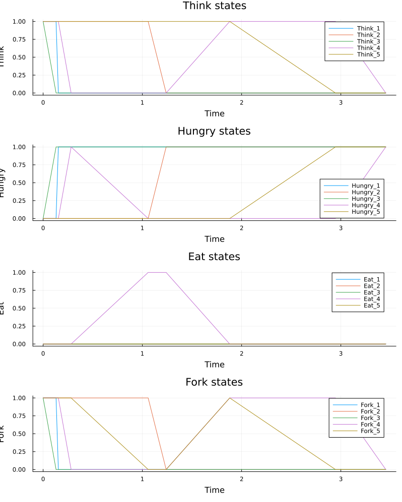
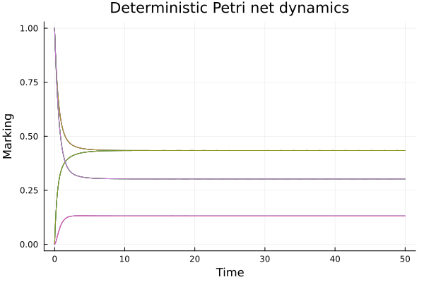
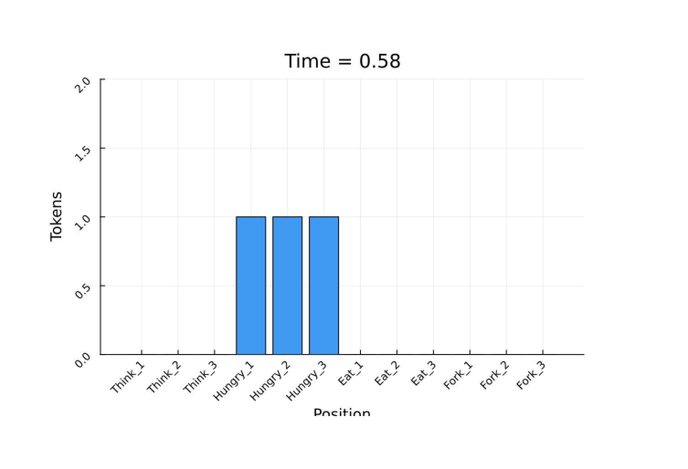
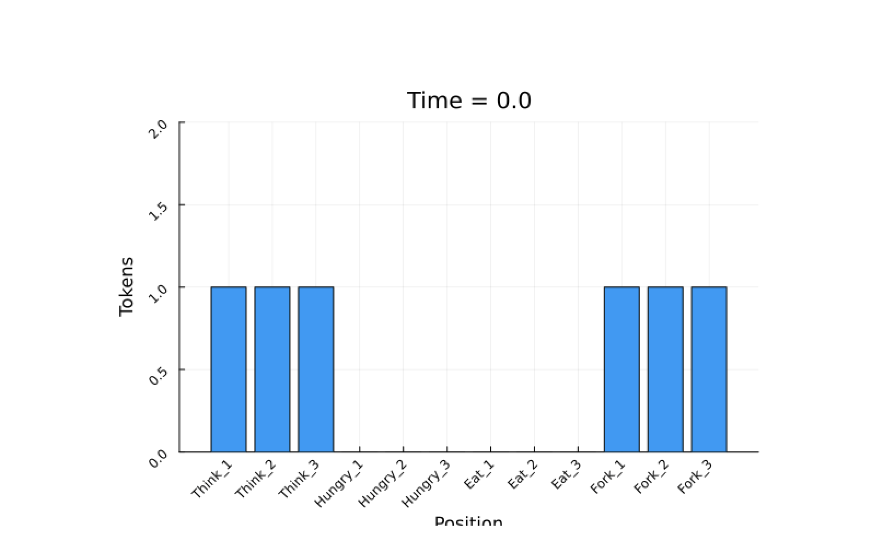
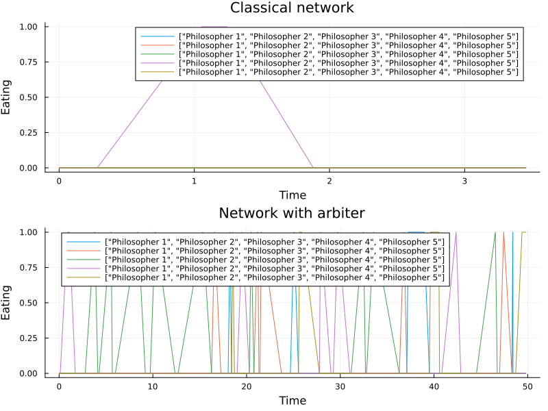
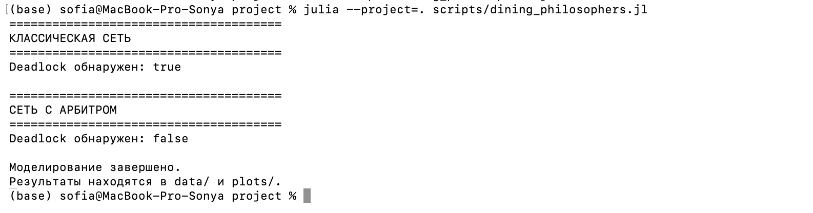
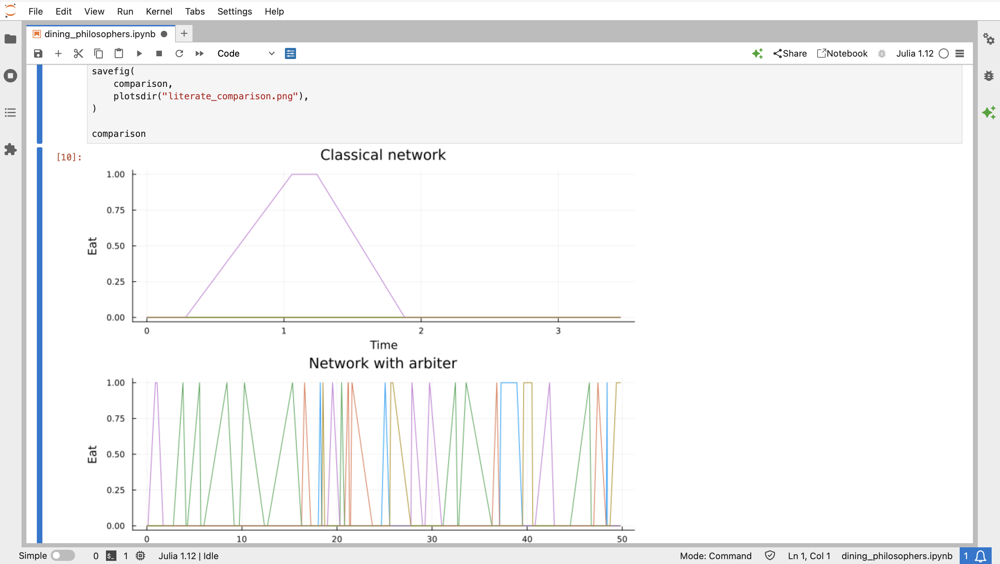

---
## Author
author:
  name: Кудякова София Андреевна
  degrees: студент
  email: 1132236033@rudn.ru
  affiliation:
    - name: Российский университет дружбы народов
      country: Российская Федерация
      postal-code: 117198
      city: Москва
      address: ул. Миклухо-Маклая, д. 6
## Title
title: "Лабораторная работа №5"
subtitle: "Аппарат сетей Петри"
license: CC BY
date: today
date-format: "2026-08-29"
format:
  beamer:
    pdf-engine: xelatex
    aspectratio: 169
    section-titles: true
    lang: ru
    babel-lang: russian
    babel-otherlangs: english
    keep-tex: true
---

# Введение

## Цель и задачи

**Цель:** изучить аппарат сетей Петри на примере задачи «Обедающие философы».

**Задачи:**

- построить классическую сеть Петри и исследовать deadlock;
- реализовать модифицированную сеть с арбитром;
- выполнить стохастическое (Гиллеспи) и детерминированное моделирование;
- построить анимацию и провести сравнительный анализ;
- реализовать литературное программирование и получить Julia/Notebook/Quarto.

## Сети Петри

Сеть Петри задаётся четвёркой:

$$
N = (P, T, F, M_0)
$$

- $P$ — позиции (состояния/ресурсы);
- $T$ — переходы (события);
- $F$ — дуги между позициями и переходами;
- $M_0$ — начальная маркировка.

Смена маркировки происходит при срабатывании разрешённого перехода.

## Задача «Обедающие философы»

$N$ философов и $N$ вилок за круглым столом. Состояния философа:

- `Think` — размышляет;
- `Hungry` — голоден;
- `Eat` — ест (нужны обе соседние вилки).

Каждая вилка — общий ресурс, недоступный одновременно двум философам.

## Deadlock и арбитр

Если все философы одновременно захватят левую вилку, каждый будет ждать правую — **взаимная блокировка (deadlock)**.

Для предотвращения вводится позиция `Arbiter` с $N-1$ фишками — не позволяет всем $N$ философам одновременно начать захват вилок.

# Реализация

## Структура проекта

Проект `lab05` на DrWatson: `src`, `scripts`, `data`, `plots`, `notebooks`, `report`.

Основной модуль: `src/DiningPhilosophers.jl` со структурой `PetriNet` (позиции, переходы, матрица инцидентности).

## Классическая сеть и сеть с арбитром

Каждый философ: позиции `Think_i`, `Hungry_i`, `Eat_i`, `Fork_i`.

При $N=5$: $4N=20$ позиций, $3N=15$ переходов.

- **Классическая сеть:** `Think` → `Hungry` (захват левой вилки) → попытка захватить правую → `Eat` → возврат вилок.
- **Сеть с арбитром:** добавлена позиция `Arbiter` с начальной маркировкой $N-1=4$ — разрешение арбитра обязательно для захвата ресурса.

# Моделирование

## Стохастическое моделирование (алгоритм Гиллеспи)

Шаг алгоритма: расчёт интенсивностей → время до события → выбор перехода → изменение маркировки → сохранение состояния.

Параметры эксперимента: $N=5$, $t_{\max}=50$.

## Классическая сеть — результат

Автоматическая проверка `detect_deadlock`: для классической сети ожидается переход в состояние без дальнейших изменений.

{#fig-classic width=75%}

## Сеть с арбитром — результат

Для сети с арбитром `detect_deadlock` должен возвращать `false`.

{#fig-arbiter width=75%}

## Детерминированное моделирование

Система ОДУ строится по матрице инцидентности сети (`simulate_ode`), решается методом `Tsit5`.

{#fig-ode width=75%}

# Анимация

## Визуализация динамики

Уменьшенная модель: $N=3$, $t_{\max}=30$. Результат — GIF-анимация `philosophers_simulation.gif`, наблюдается перемещение фишек между `Think`, `Hungry`, `Eat`, `Fork`.

{#fig-animation-1 width=45%} {#fig-animation-2 width=45%}

## Кадры анимации (продолжение)

{#fig-animation-3 width=45%} {#fig-animation-4 width=45%}

# Сравнение и литературное программирование

## Сравнительный анализ

Скрипт `dining_philosophers_report.jl` сравнивает состояние `Eat_i` классической сети и сети с арбитром.

{#fig-comparison width=75%}

В классической сети `Eat_i` перестаёт изменяться после deadlock; в сети с арбитром — продолжает изменяться.

## Литературное программирование

Файл `dining_philosophers_literate.jl` объединяет текст и код. Через `Literate.jl` получены: Julia-скрипт, Quarto-документ (`QuartoFlavor`), Jupyter Notebook.

{#fig-literate width=75%}

## Jupyter Notebook

Сгенерированный ноутбук выполнен в Jupyter, проверены ячейки и результаты.

{#fig-jupyter width=75%}

# Результаты

## Анализ

- классическая сеть демонстрирует взаимную блокировку;
- арбитр с $N-1$ разрешениями предотвращает deadlock;
- сравнение `Eat_i` подтверждает разницу в поведении моделей.

## Выводы

- реализована структура `PetriNet`, классическая и модифицированная модели;
- выполнено стохастическое (Гиллеспи) и детерминированное (ОДУ) моделирование;
- создана анимация и проведён сравнительный анализ;
- реализовано литературное программирование: Julia-скрипт, Quarto, Jupyter Notebook.

