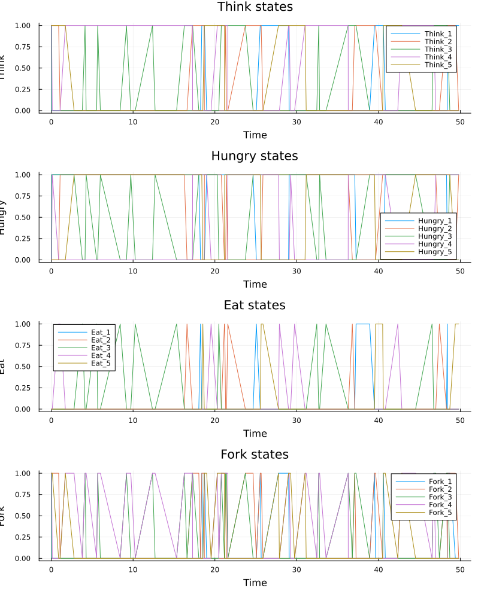
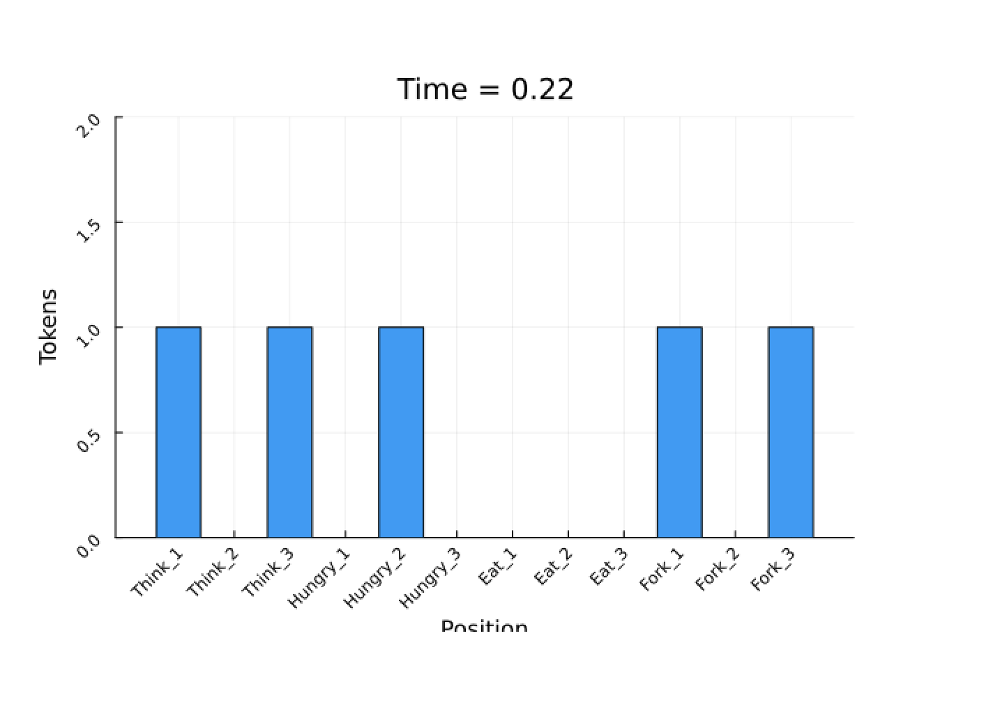
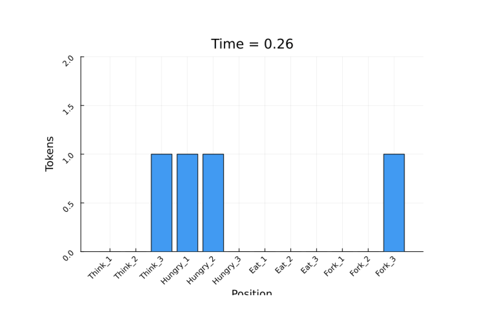

---
## Author
author:
  name: Кудякова София Андреевна
  email: 1132236033@rudn.ru
  affiliation:
    - name: Российский университет дружбы народов
      country: Российская Федерация
      postal-code: 117198
      city: Москва
      address: ул. Миклухо-Маклая, д. 6
format:
  pdf:
    pdf-engine: xelatex
    fontsize: 12pt
    geometry:
      - top=30mm
      - left=20mm
      - right=20mm
      - bottom=30mm
    lang: ru
    highlight-style: tango

## Title
title: "Отчёт по лабораторной работе №5"
subtitle: "Аппарат сетей Петри"
license: "CC BY"
---

# Цель работы

Целью лабораторной работы является изучение аппарата сетей Петри и его применение для моделирования параллельных процессов на примере задачи «Обедающие философы».

В ходе работы необходимо:

1. построить классическую сеть Петри для задачи «Обедающие философы»;
2. исследовать возникновение взаимной блокировки (`deadlock`);
3. реализовать модифицированную сеть с арбитром;
4. выполнить стохастическое моделирование с использованием алгоритма Гиллеспи;
5. выполнить детерминированное моделирование;
6. исследовать динамику маркировок;
7. построить анимацию работы сети;
8. провести сравнительный анализ классической модели и модели с арбитром;
9. оформить код в стиле литературного программирования;
10. получить производные форматы: Julia-скрипт, Jupyter Notebook и Quarto-документ;
11. выполнить параметризованное исследование.

# Теоретическое введение

## Сети Петри

Сеть Петри представляет собой математический аппарат для моделирования дискретных, параллельных и асинхронных систем.

Формально сеть Петри задаётся четвёркой

$$
N = (P, T, F, M_0),
$$

где $P$ — конечное множество позиций, $T$ — множество переходов, $F$ — множество дуг между позициями и переходами, а $M_0$ — начальная маркировка сети.

**Позиции** используются для представления состояний системы или доступных ресурсов. В позициях находятся фишки, определяющие текущее состояние модели.

**Переходы** представляют события или действия, которые могут происходить в системе.

**Дуги** задают связи между позициями и переходами.

**Маркировка** определяет распределение фишек по позициям в конкретный момент времени.

Смена маркировки происходит при срабатывании разрешённого перехода.

## Задача «Обедающие философы»

Задача «Обедающие философы» является классическим примером задачи синхронизации параллельных процессов. За круглым столом находятся $N$ философов и $N$ вилок. Каждый философ чередует состояния размышления и приёма пищи.

Для перехода в состояние еды философу необходимо получить две соседние вилки. Одна вилка находится слева от него, а другая — справа.

Основные состояния философа:

- `Think` — размышляет;
- `Hungry` — голоден;
- `Eat` — ест.

Каждая вилка является общим ресурсом и не может одновременно использоваться двумя философами.

## Проблема deadlock

При классической стратегии каждый философ сначала захватывает левую вилку, а затем пытается получить правую.

Если все философы одновременно получат по одной вилке, каждый из них будет ожидать вторую вилку, занятую соседним философом. В результате ни один процесс не сможет продолжить работу.

Такое состояние называется **взаимной блокировкой (deadlock)**. Методичка непосредственно рассматривает такую ситуацию и указывает, что классическая сеть должна приводить к deadlock [@simulation-modeling-lab-3].

## Предотвращение deadlock

Для предотвращения блокировки в работе используется **арбитр**.

В модифицированной сети вводится дополнительная позиция `Arbiter`, содержащая $N-1$ фишек. Это ограничивает число философов, которые могут одновременно начать захват вилок.

Таким образом, невозможно создать ситуацию, при которой все $N$ философов одновременно удерживают по одной вилке и ожидают вторую.

Методичка описывает именно такой способ предотвращения deadlock [@simulation-modeling-lab-3].

# Выполнение лабораторной работы

## Создание структуры проекта

Для выполнения лабораторной работы был создан отдельный проект `lab05` с использованием DrWatson.

Основной программный код размещён в каталоге `project`.

В проекте используются следующие основные каталоги:

- `src` — модуль модели;
- `scripts` — исполняемые скрипты;
- `data` — результаты моделирования;
- `plots` — графические результаты;
- `notebooks` — Jupyter Notebook;
- `report` — документация в формате Quarto.

Основной модуль модели расположен в файле:

```text
src/DiningPhilosophers.jl
```

## Реализация сети Петри

В модуле `DiningPhilosophers` реализована структура `PetriNet`.

Она содержит:

- количество позиций;
- количество переходов;
- матрицу инцидентности;
- названия позиций;
- названия переходов.

Для каждого философа классическая сеть содержит позиции:

```text
Think_i
Hungry_i
Eat_i
Fork_i
```

При $N=5$ получается:

$$
4N = 20
$$

позиций и

$$
3N = 15
$$

переходов.

Для сети с арбитром дополнительно добавляется позиция `Arbiter`, поэтому количество позиций становится равным 21.

### Классическая сеть

В классической модели философ сначала переходит из состояния `Think` в `Hungry` и захватывает левую вилку.

Затем осуществляется попытка захватить правую вилку и перейти в состояние `Eat`.

После окончания еды философ возвращает обе вилки и возвращается в состояние `Think`.

Такая структура позволяет воспроизвести классическую проблему взаимной блокировки.

### Сеть с арбитром

В модифицированной сети дополнительно используется позиция `Arbiter`.

Начальная маркировка арбитра при пяти философах составляет:

$$
N-1=4.
$$

Получение разрешения арбитра становится дополнительным условием перехода философа к захвату ресурса.

Это ограничивает количество философов, одновременно участвующих в процедуре захвата вилок.

## Стохастическое моделирование

Для исследования динамики сети реализован алгоритм Гиллеспи.

На каждом шаге:

1. рассчитываются интенсивности разрешённых переходов;
2. определяется время до следующего события;
3. случайным образом выбирается переход;
4. выполняется изменение маркировки;
5. новое состояние сохраняется в таблицу результатов.

Для основного эксперимента использовались:

$$
N=5, \qquad t_{\max}=50.
$$

Для воспроизводимости моделирования использовалось фиксированное начальное значение генератора случайных чисел.

### Классическая модель

Для классической сети был выполнен стохастический эксперимент.

Полученные состояния сохранялись в:

```text
data/dining_classic.csv
```

Также выполнялась автоматическая проверка наличия deadlock.

Методичка указывает, что для классической сети ожидается переход всех философов в состояние, при котором они больше не могут продолжать работу [@simulation-modeling-lab-3].

{#fig-classic width=90%}

На @fig-classic представлена динамика состояний позиций классической сети.

### Сеть с арбитром

Аналогичный эксперимент был выполнен для модифицированной сети.

Результаты сохранены в:

```text
data/dining_arbiter.csv
```

Для данной модели функция `detect_deadlock` должна возвращать `false`, поскольку арбитр предотвращает взаимную блокировку [@simulation-modeling-lab-3].

{#fig-arbiter width=90%}

На @fig-arbiter показано изменение состояний философов в сети с арбитром.

## Детерминированное моделирование

Помимо стохастического моделирования была реализована детерминированная модель на основе системы обыкновенных дифференциальных уравнений.

Для этого используется функция `simulate_ode`, которая формирует систему уравнений на основе матрицы инцидентности сети.

Для решения системы используется `ODEProblem` и численный метод `Tsit5`.

Результаты детерминированного эксперимента сохраняются в:

```text
data/dining_classic_ode.csv
```

Графическое представление результатов сохраняется в:

```text
plots/classic_ode.png
```

{#fig-ode width=90%}

На @fig-ode представлена динамика маркировки при детерминированном моделировании.

## Анимация

Для визуализации изменения маркировки была создана отдельная программа `dining_philosophers_animation.jl`.

Для анимации используется уменьшенная модель с тремя философами, что позволяет сделать изменение состояний более наглядным.

Параметры анимации:

$$
N=3, \qquad t_{\max}=30.
$$

В результате была получена GIF-анимация:

```text
plots/philosophers_simulation.gif
```

{#fig-animation-code width=90%}

{#fig-animation-code width=90%}

{#fig-animation-code width=90%}

{#fig-animation-code width=90%}


Анимация позволяет наблюдать перемещение фишек между позициями `Think`, `Hungry`, `Eat` и `Fork`. Методичка также отмечает, что в классической модели по мере развития deadlock маркировка может перестать изменяться, тогда как модифицированная модель с арбитром продолжает работать [@simulation-modeling-lab-3].

## Сравнительный анализ

Для непосредственного сравнения двух вариантов сети был реализован скрипт:

```text
scripts/dining_philosophers_report.jl
```

Он загружает результаты двух предыдущих экспериментов и анализирует состояние `Eat_i` каждого философа.

Результаты объединяются на одном рисунке.

{#fig-comparison width=90%}

На @fig-comparison видно различие между двумя вариантами модели.

В классической сети после возникновения взаимной блокировки состояние `Eat_i` перестаёт изменяться и философы больше не могут принимать пищу.

В сети с арбитром состояния продолжают изменяться во времени, что соответствует отсутствию deadlock.

Такой способ сравнительного анализа непосредственно предусмотрен методикой: итоговый скрипт использует `dining_classic.csv` и `dining_arbiter.csv` и строит два временных графика состояния `Eat_i` [@simulation-modeling-lab-3].

## Литературное программирование

Для выполнения требования литературного программирования был создан файл:

```text
scripts/dining_philosophers_literate.jl
```

В нём объединены поясняющий текст и программный код.

Из литературного исходного файла с помощью `Literate.jl` были получены производные форматы:

- обычный Julia-скрипт;
- документ Quarto;
- Jupyter Notebook.

Сгенерированные файлы размещаются в соответствующих каталогах проекта.

{#fig-literate width=90%}

На @fig-literate представлен исходный файл, объединяющий описание модели и программный код.

### Генерация производных форматов

Для получения обычного Julia-скрипта используется `Literate.script`.

Для получения Quarto-документа используется `Literate.markdown` с `Literate.QuartoFlavor()`.

Для получения Jupyter Notebook используется `Literate.notebook`.

Полученные файлы позволяют использовать одну исходную программу для нескольких представлений модели.

## Jupyter Notebook

Сгенерированный ноутбук был открыт и выполнен в Jupyter.

В результате выполнения были проверены программные ячейки, параметры модели и получаемые результаты.

{#fig-jupyter width=90%}

На @fig-jupyter представлен выполненный Jupyter Notebook.

## Структура проекта

В результате выполнения лабораторной работы сформирована следующая структура основных файлов:

```text
lab05/
└── project/
    ├── data/
    ├── plots/
    ├── notebooks/
    ├── report/
    ├── scripts/
    ├── src/
    │   └── DiningPhilosophers.jl
    ├── Project.toml
    └── Manifest.toml
```

Основные скрипты проекта:

```text
scripts/
├── dining_philosophers.jl
├── dining_philosophers_animation.jl
├── dining_philosophers_report.jl
├── dining_philosophers_ode.jl
├── dining_philosophers_literate.jl
└── generated/
```

# Анализ результатов

В ходе моделирования были рассмотрены два варианта сети Петри для задачи «Обедающие философы».

В классической сети каждый философ последовательно пытается получить две вилки. При неблагоприятной последовательности событий каждый философ может удерживать одну вилку и ожидать вторую. В результате возникает состояние взаимной блокировки.

Для обнаружения такого состояния была реализована функция `detect_deadlock`, анализирующая текущую маркировку и доступность переходов.

В модифицированной сети был введён арбитр. Наличие $N-1$ разрешений не позволяет всем пяти философам одновременно попасть в ситуацию взаимного ожидания.

Сравнение временных зависимостей состояния `Eat_i` показывает различие поведения двух моделей. Классическая сеть после возникновения deadlock перестаёт демонстрировать дальнейшее изменение состояния, тогда как сеть с арбитром сохраняет возможность выполнения переходов.

Таким образом, моделирование подтверждает эффективность арбитра как одного из механизмов предотвращения взаимной блокировки.

# Выводы

В результате выполнения лабораторной работы №5 «Аппарат сетей Петри» были выполнены следующие задачи:

1. Реализована структура сети Петри `PetriNet`.
2. Построена классическая модель задачи «Обедающие философы».
3. Реализована модифицированная модель с арбитром.
4. Выполнено стохастическое моделирование с использованием алгоритма Гиллеспи.
5. Реализовано обнаружение состояния deadlock.
6. Выполнено детерминированное моделирование на основе системы ОДУ.
7. Построены графики изменения маркировок.
8. Создана анимация динамики сети.
9. Выполнено сравнение классической модели и модели с арбитром.
10. Код преобразован в стиль литературного программирования.
11. Получены Julia-скрипт, Quarto-документ и Jupyter Notebook.
12. Выполнено параметризованное исследование для различных значений количества философов и времени моделирования.
13. Результаты сохранены в CSV-файлы и графические файлы проекта.

Выполненная работа позволила изучить применение сетей Петри для моделирования параллельных процессов и наглядно исследовать проблему взаимной блокировки. На примере задачи «Обедающие философы» показано, как изменение структуры сети с помощью дополнительного арбитра позволяет предотвратить deadlock.

# Список литературы {.unnumbered}

::: {#refs}
:::

