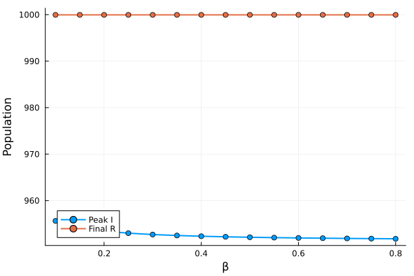
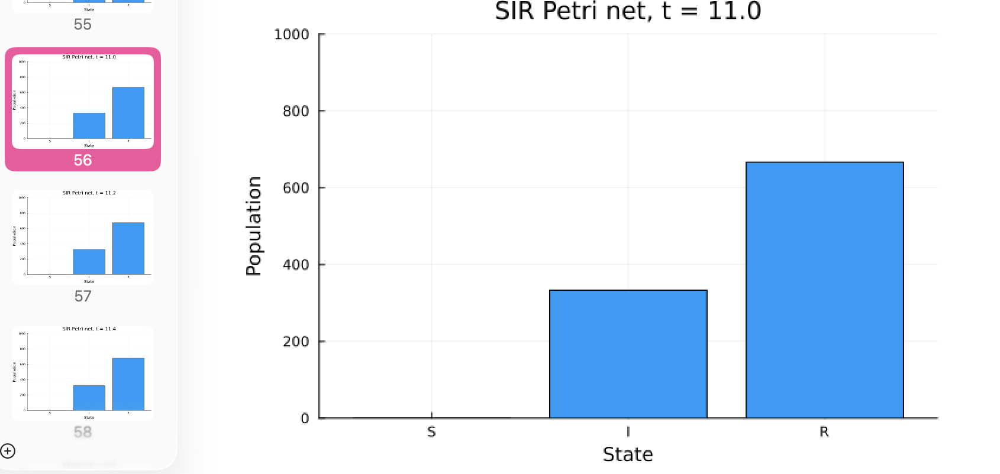
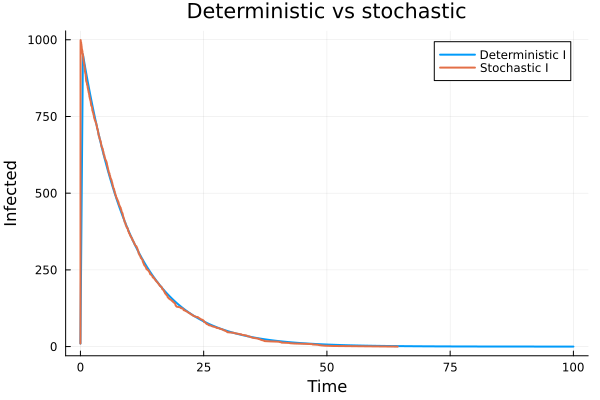

---
## Author
author:
  name: Кудякова София Андреевна
  degrees: студент
  email: 1132236033@rudn.ru
  affiliation:
    - name: Российский университет дружбы народов
      country: Российская Федерация
      postal-code: 117198
      city: Москва
      address: ул. Миклухо-Маклая, д. 6
## Title
title: "Лабораторная работа №6"
subtitle: "Реализация основных моделей в подходе сетей Петри"
license: CC BY
date: today
date-format: "2026-08-29"
format:
  beamer:
    pdf-engine: xelatex
    aspectratio: 169
    section-titles: true
    lang: ru
    babel-lang: russian
    babel-otherlangs: english
    keep-tex: true
---

# Цель работы

1. Реализовать модель эпидемии SIR с помощью сетей Петри.
2. Провести детерминированную и стохастическую симуляции.
3. Исследовать влияние коэффициента заражения $\beta$ на динамику эпидемии.
4. Создать анимацию эпидемического процесса.
5. Выполнить параметрическое исследование модели.
6. Преобразовать код в литературный стиль и создать производные форматы.

# Сеть Петри

Сеть Петри представляет собой математический аппарат для моделирования дискретных систем.

Она состоит из:

- позиций;
- переходов;
- дуг;
- маркировки сети.

Позиции содержат фишки и описывают состояние системы, а переходы соответствуют событиям, которые изменяют это состояние.

Формально сеть Петри задаётся:

$$
N=(P,T,F,M_0),
$$

где:

- $P$ — множество позиций;
- $T$ — множество переходов;
- $F$ — множество дуг;
- $M_0$ — начальная маркировка.

# Модель SIR

Модель SIR описывает распространение инфекции, разделяя население на три группы:

- $S$ — восприимчивые к заболеванию;
- $I$ — инфицированные;
- $R$ — выздоровевшие.

Суммарная численность населения сохраняется:

$$
S+I+R=N.
$$

Детерминированная модель описывается системой:

$$
\begin{aligned}
\frac{dS}{dt} &= -\beta SI, \\
\frac{dI}{dt} &= \beta SI-\gamma I, \\
\frac{dR}{dt} &= \gamma I.
\end{aligned}
$$

В работе использовалась начальная маркировка:

$$
S=990,\qquad I=10,\qquad R=0.
$$

# SIR как сеть Петри

Модель SIR представляется двумя основными переходами.

**Заражение:**

$$
S+I\rightarrow I+I
$$

**Выздоровление:**

$$
I\rightarrow R
$$

Изменение количества фишек в позициях сети Петри соответствует изменению численности восприимчивых, инфицированных и выздоровевших.

Для реализации используются:

- `AlgebraicPetri`;
- `OrdinaryDiffEq`;
- алгоритм Гиллеспи.

# Базовое моделирование

Для базового эксперимента использовались параметры:

$$
\beta=0.3,\qquad
\gamma=0.1,\qquad
T=100.
$$

Начальная маркировка:

$$
S=990,\qquad I=10,\qquad R=0.
$$

Скрипт `sirpetri_run.jl` выполняет:

- детерминированное моделирование;
- стохастическое моделирование.

Результаты сохраняются в:

```text
data/sir_det.csv
data/sir_stoch.csv
```

# Детерминированная динамика

{#fig-det width=85%}

На графике наблюдается характерная эпидемическая динамика:

- число восприимчивых уменьшается;
- число инфицированных сначала возрастает;
- количество инфицированных достигает максимума;
- затем число инфицированных снижается;
- количество выздоровевших увеличивается.

# Стохастическая динамика

{#fig-stoch width=85%}

Стохастическая модель имеет аналогичную общую динамику.

При этом отдельные значения испытывают случайные флуктуации относительно детерминированного поведения.

# Исследование влияния $\beta$

Для исследования влияния коэффициента заражения использовался скрипт:

```text
scripts/sirpetri_scan_parameters.jl
```

Была выполнена серия детерминированных экспериментов при различных значениях $\beta$ при фиксированной скорости выздоровления.

Результаты сохраняются в:

```text
data/sir_scan.csv
```

# Влияние коэффициента заражения

{#fig-scan width=85%}

Полученный график показывает, что увеличение коэффициента $\beta$ приводит к более интенсивному распространению инфекции.

При увеличении $\beta$:

- инфекция распространяется быстрее;
- возрастает максимальное число одновременно инфицированных;
- увеличивается масштаб эпидемического процесса.

# Анимация эпидемического процесса

Для визуализации изменения состояния системы во времени использовался скрипт:

```text
scripts/sirpetri_animate.jl
```

Результат сохраняется в:

```text
plots/sir_animation.gif
```

{#fig-animation width=75%}

Анимация позволяет наблюдать изменение трёх групп населения во времени:

- уменьшение числа восприимчивых;
- рост и последующее снижение числа инфицированных;
- увеличение числа выздоровевших.

# Сравнение моделей

Скрипт:

```text
scripts/sirpetri_report.jl
```

использует сохранённые результаты моделирования и формирует итоговые графики.

{#fig-comparison width=85%}

Детерминированная модель задаёт гладкую траекторию.

Стохастическая модель содержит случайные отклонения, однако сохраняет общий характер эпидемической динамики.

# Чувствительность к $\beta$

{#fig-sensitivity width=85%}

Рост $\beta$ приводит к увеличению интенсивности эпидемического процесса и изменению максимального числа инфицированных.

Таким образом, модель чувствительна к коэффициенту заражения.

# Параметрическое исследование

Для дополнительного исследования использовался скрипт:

```text
scripts/parameterized.jl
```

Он позволяет выполнять моделирование для различных наборов параметров модели.

Результаты параметрического исследования представлены в:

```text
notebooks/parameterized.ipynb
```

{#fig-parameterized width=85%}

Параметризация позволяет:

- изменять исходные параметры модели;
- выполнять серию экспериментов;
- сравнивать результаты;
- воспроизводить вычислительный эксперимент.

# Литературное программирование

Для оформления исходного кода в литературном стиле был создан файл:

```text
scripts/sirpetri_literate.jl
```

Литературное программирование объединяет программный код с поясняющим текстом.

В результате были сформированы:

```text
notebooks/sirpetri_literate.ipynb
report/sirpetri_literate.qmd
report/parameterized.qmd
```

Такой подход позволяет одновременно представить алгоритм, его описание и результаты вычислений.

# Структура проекта

Основная структура проекта:

```text
project/
├── data/
│   ├── sir_det.csv
│   ├── sir_scan.csv
│   └── sir_stoch.csv
├── notebooks/
│   ├── parameterized.ipynb
│   └── sirpetri_literate.ipynb
├── plots/
│   ├── comparison.png
│   ├── sensitivity.png
│   ├── sir_animation.gif
│   ├── sir_det_dynamics.png
│   ├── sir_scan.png
│   └── sir_stoch_dynamics.png
├── report/
│   ├── parameterized.qmd
│   └── sirpetri_literate.qmd
├── scripts/
│   ├── parameterized.jl
│   ├── sirpetri_animate.jl
│   ├── sirpetri_literate.jl
│   ├── sirpetri_report.jl
│   ├── sirpetri_run.jl
│   └── sirpetri_scan_parameters.jl
└── src/
    └── SIRPetri.jl
```

Такая структура разделяет:

- исходный код;
- данные;
- результаты моделирования;
- документацию;
- Jupyter-ноутбуки.

# Основные результаты

В ходе работы:

- реализована модель SIR на основе сети Петри;
- выполнено детерминированное моделирование;
- выполнено стохастическое моделирование;
- исследовано влияние $\beta$;
- построены графики динамики;
- создана анимация;
- выполнено сравнение моделей;
- проведено параметрическое исследование;
- реализовано литературное программирование;
- созданы Jupyter-ноутбуки и Quarto-документы.

# Выводы

Сети Петри позволяют удобно представлять переходы между состояниями эпидемиологической модели.

Детерминированная и стохастическая модели демонстрируют общий характер распространения инфекции, однако стохастическая модель дополнительно учитывает случайные отклонения.

Изменение коэффициента $\beta$ существенно влияет на скорость и масштаб распространения инфекции.

Параметрическое исследование позволяет воспроизводимо изучать поведение модели при различных исходных условиях.

Литературное программирование объединяет исходный код, пояснения и результаты вычислений в едином представлении.

