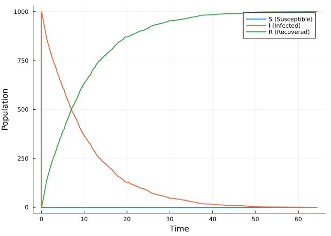
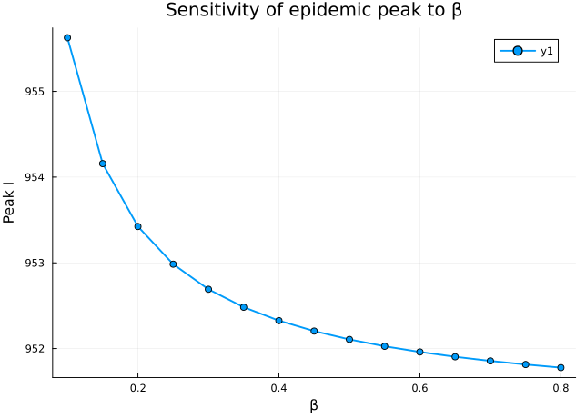
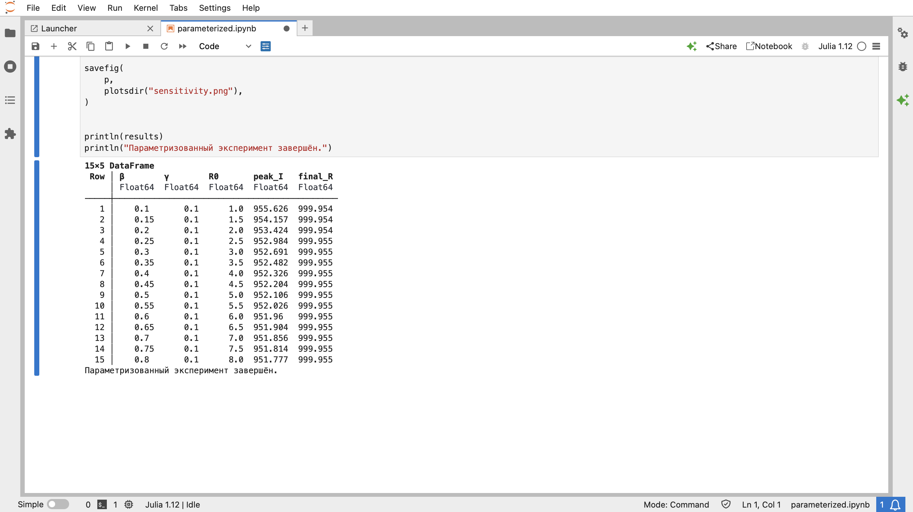

---
## Author
author:
  name: Кудякова София Андреевна
  email: 1132236033@rudn.ru
  affiliation:
    - name: Российский университет дружбы народов
      country: Российская Федерация
      postal-code: 117198
      city: Москва
      address: ул. Миклухо-Маклая, д. 6
format:
  pdf:
    pdf-engine: xelatex
    fontsize: 12pt
    geometry:
      - top=30mm
      - left=20mm
      - right=20mm
      - bottom=30mm
    lang: ru
    highlight-style: tango

## Title
title: "Отчёт по лабораторной работе №6"
subtitle: "Реализация основных моделей в подходе сетей Петри"
license: "CC BY"
---

# Цель работы

1. Реализовать модель эпидемии SIR с помощью сетей Петри.
2. Провести детерминированную и стохастическую симуляции.
3. Исследовать влияние коэффициента заражения $\beta$ на динамику эпидемии.
4. Создать анимацию эпидемического процесса.
5. Преобразовать код в литературный стиль и сгенерировать производные форматы.
6. Выполнить параметрическое исследование модели.
7. Подготовить итоговый отчёт с графиками, анимацией и результатами моделирования.

# Задание

1. Создать рабочий каталог для кода и установить необходимые пакеты Julia.
2. Реализовать модуль `SIRPetri.jl` для построения и моделирования сети Петри.
3. Выполнить базовое детерминированное и стохастическое моделирование.
4. Сохранить результаты моделирования в CSV-файлы.
5. Исследовать влияние коэффициента заражения $\beta$ на динамику эпидемии.
6. Построить соответствующие графики.
7. Создать анимацию динамики модели SIR.
8. Выполнить сравнительный анализ детерминированной и стохастической моделей.
9. Преобразовать код в литературный стиль с использованием `Literate.jl`.
10. Сгенерировать и выполнить Jupyter-ноутбуки и Quarto-документы.

# Теоретическое введение

## Сети Петри

Сеть Петри представляет собой математический аппарат для моделирования дискретных систем. Она состоит из позиций, переходов и дуг, связывающих их.

Позиции содержат фишки и описывают состояние моделируемой системы. Переходы соответствуют событиям, которые изменяют состояние системы. Распределение фишек по позициям называется маркировкой сети Петри.

Формально сеть Петри задаётся четвёркой

$$
N=(P,T,F,M_0),
$$

где $P$ — множество позиций, $T$ — множество переходов, $F$ — множество дуг, а $M_0$ — начальная маркировка.

Срабатывание разрешённого перехода изменяет текущую маркировку сети. Благодаря этому сети Петри позволяют описывать последовательность событий и взаимодействие процессов.

## Модель SIR

Модель SIR является классической математической моделью распространения инфекции. Население разделяется на три группы:

- $S$ — восприимчивые к заболеванию;
- $I$ — инфицированные;
- $R$ — выздоровевшие.

Суммарная численность населения сохраняется:

$$
S+I+R=N.
$$

Детерминированная модель описывается системой дифференциальных уравнений:

$$
\begin{aligned}
\frac{dS}{dt} &= -\beta SI, \\
\frac{dI}{dt} &= \beta SI-\gamma I, \\
\frac{dR}{dt} &= \gamma I.
\end{aligned}
$$

Здесь $\beta$ обозначает коэффициент заражения, а $\gamma$ — скорость выздоровления.

В работе используется начальная маркировка

$$
S=990,\qquad I=10,\qquad R=0.
$$

## Представление SIR сетью Петри

Модель SIR представляется двумя основными переходами:

- **infection** — заражение восприимчивого человека:
  $$
  S+I\rightarrow I+I;
  $$
- **recovery** — выздоровление инфицированного:
  $$
  I\rightarrow R.
  $$

Таким образом, изменение числа фишек в позициях сети Петри соответствует изменению численности восприимчивых, инфицированных и выздоровевших.

В реализации используется пакет `AlgebraicPetri`. Для детерминированного моделирования используется пакет `OrdinaryDiffEq`, а стохастическое моделирование выполняется с использованием алгоритма Гиллеспи.

# Выполнение лабораторной работы

## Подготовка рабочего пространства

Для лабораторной работы был создан проект Julia в каталоге `lab06/project`.

В проекте реализован модуль:

```text
src/SIRPetri.jl
```

Основные скрипты находятся в каталоге:

```text
scripts/
```

В нём реализованы:

- `sirpetri_run.jl` — базовый запуск модели;
- `sirpetri_scan_parameters.jl` — исследование параметра $\beta$;
- `sirpetri_animate.jl` — создание анимации;
- `sirpetri_report.jl` — формирование итоговых графиков;
- `sirpetri_literate.jl` — литературная версия программы;
- `parameterized.jl` — параметризованный запуск экспериментов.

## Базовый прогон модели SIR

Для базового эксперимента использовались параметры:

$$
\beta=0.3,\qquad \gamma=0.1,\qquad T=100.
$$

Скрипт `sirpetri_run.jl` выполняет детерминированное и стохастическое моделирование и сохраняет результаты в:

```text
data/sir_det.csv
data/sir_stoch.csv
```

Полученные динамики представлены на @fig-det и @fig-stoch.

{#fig-det width=85%}

{#fig-stoch width=85%}

На детерминированном графике наблюдается характерная эпидемическая динамика: число восприимчивых уменьшается, число инфицированных сначала возрастает, достигает максимума, а затем снижается. Число выздоровевших постепенно увеличивается.

Стохастическая модель имеет аналогичную общую динамику, однако отдельные значения испытывают случайные флуктуации.

## Исследование влияния коэффициента заражения

Для исследования влияния $\beta$ используется скрипт:

```text
scripts/sirpetri_scan_parameters.jl
```

Выполняется серия детерминированных экспериментов при различных значениях коэффициента заражения при фиксированной скорости выздоровления.

Результаты сохраняются в:

```text
data/sir_scan.csv
```

Графическое представление результатов показано на @fig-scan.

{#fig-scan width=85%}

Полученный график показывает, что увеличение коэффициента $\beta$ приводит к более интенсивному распространению инфекции. При малых значениях коэффициента заражения эпидемический процесс развивается значительно слабее, а при его увеличении возрастает максимальное число одновременно инфицированных и итоговая доля выздоровевших.

## Анимация эпидемического процесса

Для визуализации изменения состояния системы во времени используется скрипт:

```text
scripts/sirpetri_animate.jl
```

Результат сохраняется в:

```text
plots/sir_animation.gif
```

{#fig-animation-pdf width=85%}


Анимация позволяет наглядно проследить изменение трёх групп населения во времени: уменьшение числа восприимчивых, рост и последующее снижение числа инфицированных, а также увеличение числа выздоровевших.

## Итоговые сравнительные графики

Скрипт:

```text
scripts/sirpetri_report.jl
```

использует сохранённые результаты моделирования и формирует итоговые графики.

Сравнение детерминированной и стохастической моделей представлено на @fig-comparison.

{#fig-comparison width=85%}

На графике видно, что стохастическая модель сохраняет общий характер детерминированной динамики, но содержит случайные отклонения.

Чувствительность максимального числа инфицированных к коэффициенту $\beta$ показана на @fig-sensitivity.

{#fig-sensitivity width=85%}

Рост $\beta$ приводит к увеличению интенсивности эпидемического процесса и изменению максимального числа инфицированных.

## Параметрическое исследование

Для дополнительного исследования был использован скрипт:

```text
scripts/parameterized.jl
```

Он позволяет выполнять моделирование для различных наборов параметров модели.

Результаты параметрического исследования представлены в Jupyter-ноутбуке:

```text
notebooks/parameterized.ipynb
```

{#fig-parameterized width=85%}

Параметризация позволяет исследовать изменение поведения модели при изменении исходных условий и сравнивать результаты отдельных экспериментов.

Использование параметризованного запуска делает эксперимент воспроизводимым и позволяет проводить серию вычислений без изменения основной реализации модели.

## Литературное программирование

Для оформления исходного кода в литературном стиле был создан файл:

```text
scripts/sirpetri_literate.jl
```

Литературное программирование объединяет программный код с поясняющим текстом. Это позволяет одновременно представить алгоритм и объяснить назначение его отдельных частей.

На основе литературного исходного кода были сформированы производные документы.

В проекте присутствует Jupyter-ноутбук:

```text
notebooks/sirpetri_literate.ipynb
```

а также Quarto-документ:

```text
report/sirpetri_literate.qmd
```

Полученные документы позволяют воспроизводить вычисления и просматривать результаты вместе с поясняющим текстом.

### Реализация литературной версии

Основная литературная версия программы содержит описание построения модели SIR, параметров моделирования и получения результатов.

Сгенерированный Quarto-документ:

```text
report/sirpetri_literate.qmd
```

может использоваться как документация к соответствующей реализации.

Для параметрического эксперимента также существует отдельный Quarto-документ:

```text
report/parameterized.qmd
```

и Jupyter-ноутбук:

```text
notebooks/parameterized.ipynb
```

Таким образом, в проекте представлены несколько взаимосвязанных представлений одного вычислительного эксперимента: исходные Julia-скрипты, литературный код, Quarto-документы и Jupyter-ноутбуки.

## Структура проекта

Основная структура проекта имеет следующий вид:

```text
project/
├── data/
│   ├── sir_det.csv
│   ├── sir_scan.csv
│   └── sir_stoch.csv
├── notebooks/
│   ├── parameterized.ipynb
│   └── sirpetri_literate.ipynb
├── plots/
│   ├── comparison.png
│   ├── sensitivity.png
│   ├── sir_animation.gif
│   ├── sir_det_dynamics.png
│   ├── sir_scan.png
│   └── sir_stoch_dynamics.png
├── report/
│   ├── parameterized.qmd
│   └── sirpetri_literate.qmd
├── scripts/
│   ├── parameterized.jl
│   ├── sirpetri_animate.jl
│   ├── sirpetri_literate.jl
│   ├── sirpetri_report.jl
│   ├── sirpetri_run.jl
│   └── sirpetri_scan_parameters.jl
└── src/
    └── SIRPetri.jl
```

Такая структура разделяет исходный код, данные, результаты моделирования, документацию и ноутбуки.

# Анализ результатов

Проведённые эксперименты позволяют сделать следующие наблюдения.

1. **Детерминированная модель.** Полученная динамика соответствует классическому поведению модели SIR. После увеличения числа инфицированных их количество достигает максимума, после чего уменьшается.
2. **Стохастическая модель.** Стохастическая траектория имеет случайные отклонения относительно детерминированного решения, однако сохраняет общую форму эпидемической динамики.
3. **Влияние $\beta$.** Увеличение коэффициента заражения приводит к более быстрому распространению инфекции и увеличению масштаба эпидемии.
4. **Анимация.** Визуализация позволяет наблюдать изменение состояний $S$, $I$ и $R$ непосредственно во времени.
5. **Параметрическое исследование.** Использование отдельного параметризованного скрипта позволяет воспроизводимо запускать серию экспериментов с различными параметрами.
6. **Литературное программирование.** Представление кода в литературном стиле позволяет объединить описание алгоритма, исходный код и результаты вычислений в едином документе.

# Выводы

В ходе выполнения лабораторной работы №6 была реализована модель распространения эпидемии SIR с использованием аппарата сетей Петри.

Были выполнены следующие задачи:

- реализован модуль `SIRPetri.jl`;
- создана модель SIR на основе сети Петри;
- выполнено детерминированное моделирование;
- выполнено стохастическое моделирование с учётом случайности;
- исследовано влияние коэффициента заражения $\beta$;
- построены графики динамики эпидемии;
- создана анимация процесса;
- сформированы итоговые сравнительные графики;
- выполнено параметрическое исследование;
- реализовано литературное представление исходного кода;
- созданы Jupyter-ноутбуки и Quarto-документы.

Результаты показывают, что сети Петри позволяют удобно представлять переходы между состояниями эпидемиологической модели, а сочетание детерминированного и стохастического подходов даёт возможность рассматривать как среднюю динамику процесса, так и случайные отклонения.

# Список литературы {.unnumbered}

::: {#refs}
:::
