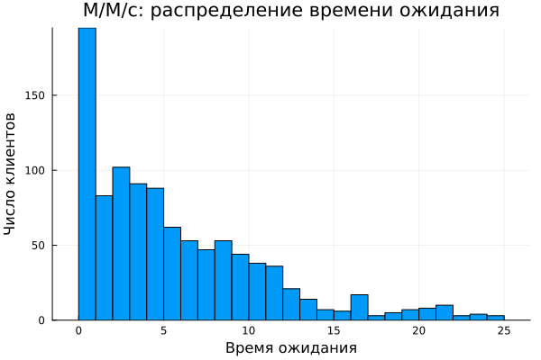
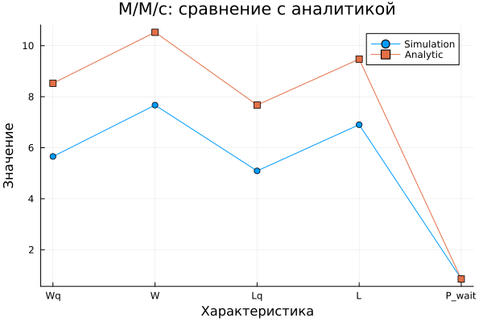
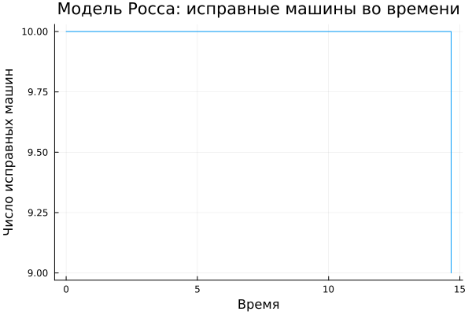
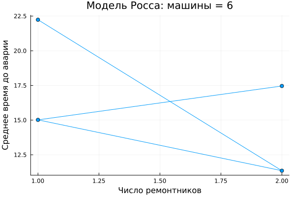

---
## Author
author:
  name: Кудякова София Андреевна
  degrees: студент
  email: 1132236033@rudn.ru
  affiliation:
    - name: Российский университет дружбы народов
      country: Российская Федерация
      postal-code: 117198
      city: Москва
      address: ул. Миклухо-Маклая, д. 6
## Title
title: "Лабораторная работа №7"
subtitle: "Дискретно-событийное моделирование"
license: CC BY
date: today
date-format: "2026-08-29"
format:
  beamer:
    pdf-engine: xelatex
    aspectratio: 169
    section-titles: true
    lang: ru
    babel-lang: russian
    babel-otherlangs: english
    keep-tex: true
---

# Цель работы

- Освоить дискретно-событийное моделирование в Julia с использованием `ConcurrentSim`.
- Реализовать модели **M/M/c** и **Росса**.
- Провести параметрические эксперименты.
- Построить и проанализировать результаты моделирования.
- Использовать литературное программирование с `Literate.jl`.

# Дискретно-событийное моделирование

**Discrete-Event Simulation (DES)** — метод моделирования, при котором состояние системы изменяется в дискретные моменты времени при наступлении событий.

Основные события:

- прибытие заявки;
- начало и окончание обслуживания;
- отказ машины;
- окончание ремонта.

Между событиями состояние системы не изменяется.

# Модель M/M/c

Система **M/M/c** характеризуется:

- пуассоновским входящим потоком с интенсивностью $\lambda$;
- экспоненциальным временем обслуживания с интенсивностью $\mu$;
- $c$ параллельными обслуживающими устройствами.

Загрузка системы:

$$
\rho = \frac{\lambda}{c\mu}
$$

Стационарный режим существует при $\rho < 1$.

Исследовались время ожидания заявок и загрузка очереди.

# Результаты M/M/c

{width=85%}

При увеличении нагрузки системы время ожидания заявок возрастает.

# Загрузка очереди M/M/c

{width=85%}

Рост нагрузки приводит к увеличению вероятности образования очереди.

Параметрическое исследование проводилось при изменении:

- количества серверов $c$;
- интенсивности поступления заявок $\lambda$;
- загрузки системы $\rho$.

Увеличение числа серверов позволяет снизить нагрузку на очередь.

# Модель Росса

Модель Росса описывает систему с:

- $N$ основными машинами;
- $S$ резервными машинами;
- ремонтниками;
- отказами и последующим ремонтом.

При отказе работающая машина заменяется резервной, если резерв доступен.

Отказавшая машина поступает в ремонт.

При отсутствии резерва система может перейти в состояние краха.

# Динамика исправных машин

{width=85%}

График показывает изменение количества исправных машин во времени вследствие отказов и ремонтов.

# Распределение времени до краха

{width=85%}

Гистограмма показывает распределение времени до краха системы по результатам имитационных экспериментов.

Чем больше время до краха, тем выше живучесть системы.

# Влияние числа ремонтников

Исследовалось влияние количества ремонтников на время до краха системы.

Рассматривались два варианта:

- $N=10$ основных машин;
- $N=6$ основных машин.

# Ремонтники: N = 10

{width=85%}

Увеличение числа ремонтников позволяет быстрее восстанавливать отказавшие машины.

# Ремонтники: N = 6

{width=85%}

Влияние числа ремонтников зависит от количества основных машин и других параметров системы.

# Влияние резервных машин

Количество резервных машин $S$ является важным параметром модели Росса.

Чем больше доступный резерв, тем больше отказов можно компенсировать без немедленного краха системы.

Исследование проведено для $N=10$ и $N=6$.

# Резерв: N = 10

{width=85%}

Увеличение количества резервных машин позволяет дольше поддерживать работоспособность системы после отказов.

# Резерв: N = 6

{width=85%}

График показывает зависимость времени работы системы до краха от количества резервных машин.

# Параметрические эксперименты

Для автоматизации серии экспериментов использовались:

```text
des_parameterized.jl
ross_scan_parameters.jl
```

Результаты сохранялись в CSV-файлы:

```text
data/des_mmc_summary.csv
data/des_ross_summary.csv
data/mmc_summary.csv
data/ross_crash_times.csv
data/ross_parameter_scan.csv
data/ross_parameterized.csv
data/ross_summary.csv
```

Параметрический подход позволяет исследовать различные варианты системы без изменения основной реализации моделей.

# Литературное программирование

Для преобразования исходного кода использовался **Literate.jl**.

В проекте присутствуют:

```text
scripts/des_literate.jl
scripts/des_parameterized_literate.jl
```

Литературное программирование объединяет исходный код с поясняющим текстом и позволяет формировать производные документы.

# Структура проекта

```text
project/
├── data/
├── plots/
├── scripts/
├── src/
├── test/
├── Project.toml
├── Manifest.toml
└── README.md
```

- `data/` — результаты моделирования;
- `plots/` — графики;
- `scripts/` — скрипты экспериментов.

# Выводы

В ходе лабораторной работы:

- изучено дискретно-событийное моделирование;
- реализована модель **M/M/c**;
- исследовано влияние параметров системы на очередь;
- реализована модель **Росса** с резервированием и ремонтом;
- исследовано влияние числа ремонтников;
- исследовано влияние количества резервных машин;
- выполнены параметрические эксперименты;
- использован `Literate.jl`.

**Итог:** параметры системы оказывают существенное влияние на время ожидания, надёжность и время до краха.
