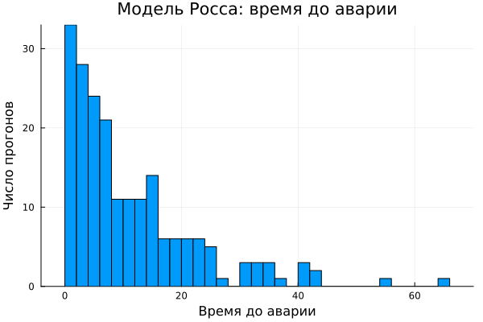
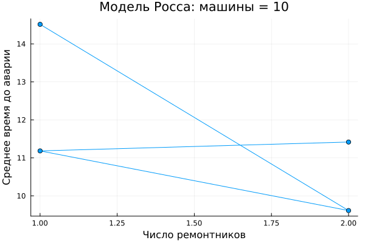
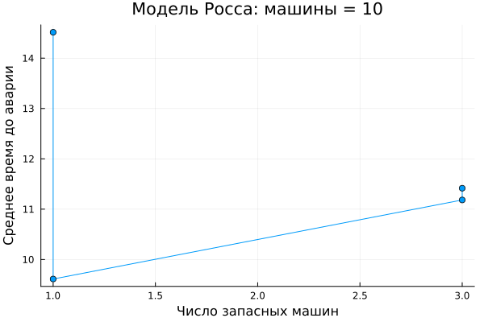
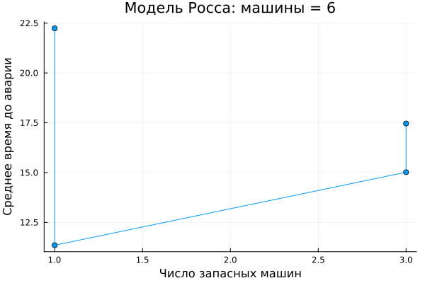

---
## Author
author:
  name: Кудякова София Андреевна
  email: 1132236033@rudn.ru
  affiliation:
    - name: Российский университет дружбы народов
      country: Российская Федерация
      postal-code: 117198
      city: Москва
      address: ул. Миклухо-Маклая, д. 6
format:
  pdf:
    pdf-engine: xelatex
    fontsize: 12pt
    geometry:
      - top=30mm
      - left=20mm
      - right=20mm
      - bottom=30mm
    lang: ru
    highlight-style: tango

## Title
title: "Отчёт по лабораторной работе №7"
subtitle: "Дискретно-событийное моделирование"
license: "CC BY"
---


# Цель работы

1. Освоить дискретно-событийное моделирование с использованием пакета ConcurrentSim в Julia.
2. Реализовать модель системы массового обслуживания M/M/c.
3. Реализовать модель Росса с резервированием и ремонтом.
4. Провести параметрические исследования моделей.
5. Построить графики динамики систем и проанализировать полученные результаты.
6. Преобразовать код в литературный стиль и подготовить производные форматы.

# Задание

1. Создать рабочий каталог для проекта и установить необходимые пакеты Julia.
2. Реализовать модель M/M/c.
3. Выполнить базовое моделирование системы массового обслуживания.
4. Исследовать влияние параметров системы M/M/c.
5. Реализовать модель Росса с резервированием и ремонтом.
6. Исследовать влияние числа ремонтников.
7. Исследовать влияние количества основных и резервных машин.
8. Построить графики результатов моделирования.
9. Выполнить параметрические эксперименты.
10. Преобразовать код в литературный стиль с использованием Literate.jl.

# Теоретическое введение

## Дискретно-событийное моделирование

Дискретно-событийное моделирование (Discrete-Event Simulation, DES) — подход, при котором состояние системы изменяется только в дискретные моменты времени, связанные с наступлением событий.

К таким событиям относятся прибытие заявки, начало и окончание обслуживания, отказ машины и окончание ремонта.

Между событиями состояние системы считается неизменным. Такой подход позволяет эффективно моделировать системы массового обслуживания и системы с резервированием.

## Модель M/M/c

Система M/M/c характеризуется:

- пуассоновским входящим потоком с интенсивностью $\lambda$;
- экспоненциальным временем обслуживания с интенсивностью $\mu$;
- $c$ параллельными обслуживающими устройствами.

Загрузка системы определяется:

$$
\rho = \frac{\lambda}{c\mu}.
$$

Стационарный режим существует при:

$$
\rho < 1.
$$

Основными показателями являются среднее время ожидания в очереди $W_q$ и загрузка системы.

## Модель Росса

Модель Росса описывает систему с конечным числом работающих машин, резервными машинами и ремонтниками.

Основные параметры:

- $N$ — количество основных машин;
- $S$ — количество резервных машин;
- количество ремонтников;
- интенсивность отказов;
- время ремонта.

При отказе работающая машина заменяется резервной, если резерв доступен. Отказавшая машина поступает в ремонт.

Если резерв отсутствует, система может перейти в состояние краха.

# Выполнение лабораторной работы

## Подготовка рабочего пространства

Для лабораторной работы был создан проект в каталоге `labs/lab07/project`.

Основные скрипты проекта:

```text
mmc_run.jl
ross_run.jl
ross_scan_parameters.jl
des_report.jl
des_parameterized.jl
des_literate.jl
des_parameterized_literate.jl
```

Результаты моделирования сохраняются в каталогах `data/` и `plots/`.

## Модель M/M/c

### Базовый эксперимент

Для исследования системы массового обслуживания M/M/c использовалась модель с несколькими параллельными серверами.

Исследовались:

- время ожидания заявок;
- загрузка очереди;
- изменение характеристик системы при изменении параметров.

**Время ожидания заявок**

{#fig-mmc-wait width=85%}

График показывает изменение времени ожидания заявок в процессе моделирования системы массового обслуживания. При увеличении нагрузки на систему время ожидания заявок возрастает.

**Загрузка очереди M/M/c**

{#fig-mmc-load width=85%}

График показывает динамику загрузки очереди в процессе работы системы. Рост нагрузки приводит к увеличению вероятности образования очереди.

### Параметрическое исследование M/M/c

Для исследования поведения системы выполнялось изменение основных параметров модели.

Рассматривалось влияние:

- количества серверов $c$;
- интенсивности поступления заявок $\lambda$;
- загрузки системы $\rho$.

Увеличение количества обслуживающих устройств позволяет одновременно обрабатывать больше заявок и снижать нагрузку на очередь.

## Модель Росса

### Базовое моделирование

Вторая часть лабораторной работы посвящена модели Росса с резервированием и ремонтом.

В модели рассматриваются работающие машины, резервные машины и ремонтники. После отказа машины резерв используется для сохранения работоспособности системы, а отказавшая машина направляется в ремонт.

**Динамика исправных машин**

{#fig-ross-good width=85%}

График показывает изменение количества исправных машин во времени вследствие отказов и последующих ремонтов. Изменение количества исправных машин является одной из основных характеристик состояния системы.

**Распределение времени до краха**

Для анализа надёжности системы исследовалось время до краха.

{#fig-ross-crash width=85%}

Гистограмма показывает распределение времени до краха системы по результатам имитационных экспериментов. Чем больше время до краха, тем выше живучесть системы.

### Влияние числа ремонтников

Одним из исследуемых параметров является количество ремонтников. Увеличение количества ремонтников позволяет быстрее восстанавливать отказавшие машины и уменьшать нагрузку на очередь ремонта.

**Система с 10 основными машинами**

{#fig-repairers-10 width=85%}

График показывает зависимость времени до краха от количества ремонтников для системы с 10 основными машинами.

**Система с 6 основными машинами**

{#fig-repairers-6 width=85%}

Результат показывает зависимость времени до краха от количества ремонтников при другом количестве основных машин.

Таким образом, влияние ремонтников зависит от параметров всей системы.

### Влияние количества резервных машин

Количество резервных машин $S$ является важным параметром модели Росса. Чем больше доступный резерв, тем больше отказов может произойти без немедленного краха системы.

**Система с 10 основными машинами**

{#fig-spares-10 width=85%}

Увеличение количества резервных машин позволяет дольше поддерживать работоспособность системы после отказов основных машин.

**Система с 6 основными машинами**

{#fig-spares-6 width=85%}

График демонстрирует зависимость времени работы системы до краха от количества доступных резервных машин.

## Параметрические эксперименты

Для автоматизации серии экспериментов использовались:

```text
des_parameterized.jl
ross_scan_parameters.jl
```

Полученные результаты сохраняются в CSV-файлы:

```text
data/des_mmc_summary.csv
data/des_ross_summary.csv
data/mmc_summary.csv
data/ross_crash_times.csv
data/ross_parameter_scan.csv
data/ross_parameterized.csv
data/ross_summary.csv
```

Параметрический подход позволяет проводить серию экспериментов без изменения основной реализации моделей.

## Литературное программирование

Для преобразования исходного кода в литературный стиль использовался Literate.jl.

В проекте присутствуют:

```text
scripts/des_literate.jl
scripts/des_parameterized_literate.jl
```

Литературное программирование объединяет исходный код с поясняющим текстом и позволяет формировать производные документы. Такой подход делает вычислительный эксперимент более понятным и воспроизводимым.

## Структура проекта

```text
project/
├── data/
```
# Выводы

Дискретно-событийное моделирование позволяет исследовать системы, состояние которых изменяется в моменты наступления отдельных событий.

Для модели M/M/c увеличение числа серверов позволяет снизить время ожидания заявок.

Для модели Росса количество ремонтников и резервных машин влияет на надёжность системы и время до краха.

Параметрические эксперименты позволяют исследовать влияние основных характеристик системы и сравнивать различные варианты её организации.

# Список литературы {.unnumbered}

::: {#refs}
:::
